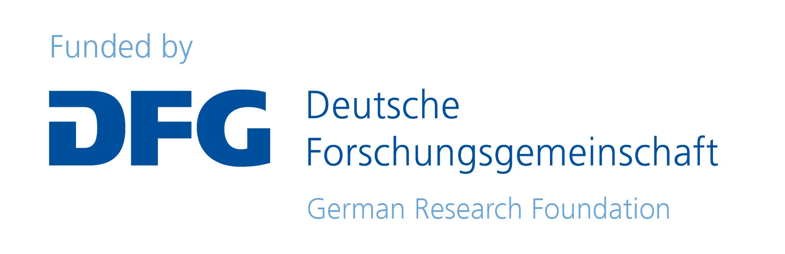
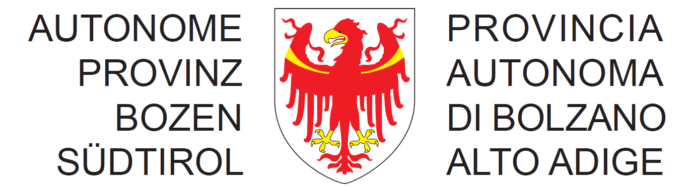

## Code of Conduct

### This research work is partially funded by the following research projects,

| Links                                                                                      | **European Union (EU)** Projects                                              | Country | Grant No. |
| ------------------------------------------------------------------------------------------ | ----------------------------------------------------------------------------- | ------- | --------- |
|                       | Wallenberg AI, Autonomous Systems and Software Program (WASP)                 | Sweden  | 570011362 |
|  | Dense and Deep Geographic Virtual Knowledge Graphs for Visual Analysis (D2G2) | Germany | 500249124 |
|                                                | Autonomous Province of Bolzano-Bozen, South Tyrol                             | Italy   |           |
|         | HEU project CyclOps                                                           | Spain   | 101135513 |
