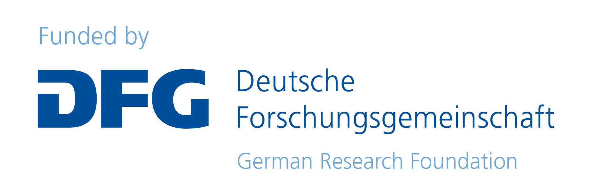
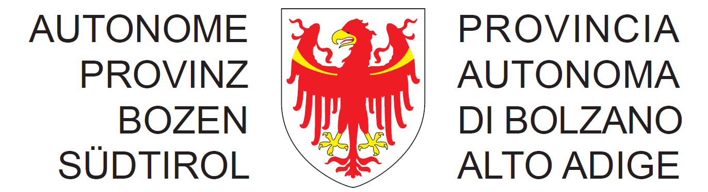

# Funded by

| European Union (EU) Projects                                                    | **Body**                                                                                     | Country |
| ------------------------------------------------------------------------------- | -------------------------------------------------------------------------------------------- | ------- |
|                       | Wallenberg AI, Autonomous Systems and Software Program (WASP)                                | Sweden  |
|  | Dense and Deep Geographic Virtual Knowledge Graphs for Visual Analysis (D2G2) - DFG500249124 | Germany |
|                                                | Autonomous Province of Bolzano-Bozen, South Tyrol                                            | Italy   |
|         | HEU project CyclOps (grant agreement no.~101135513)                                          | Italy   |
