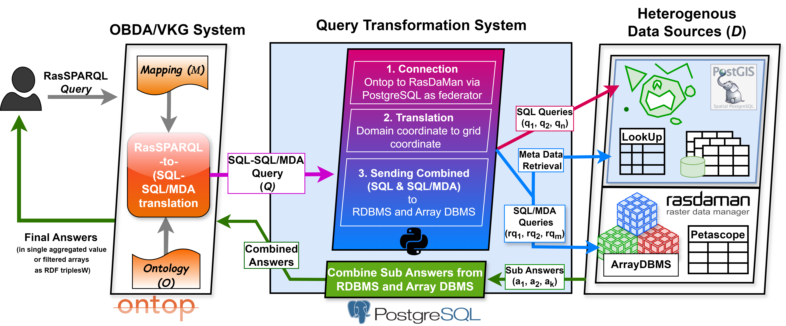
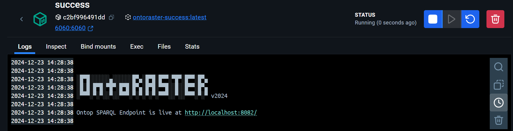
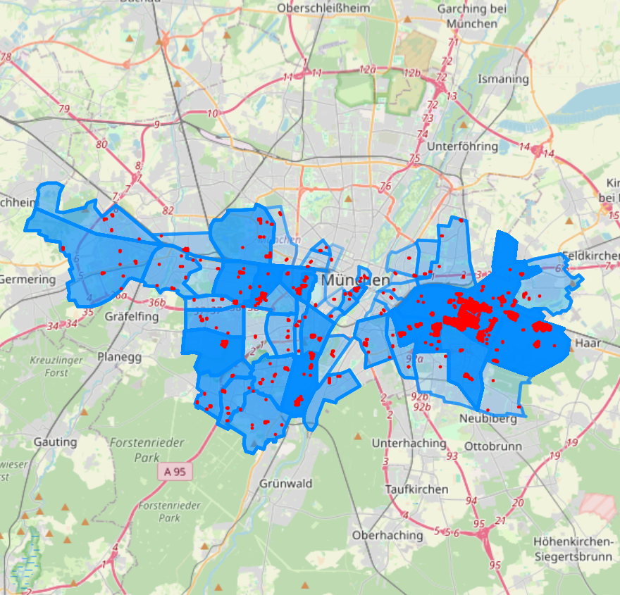
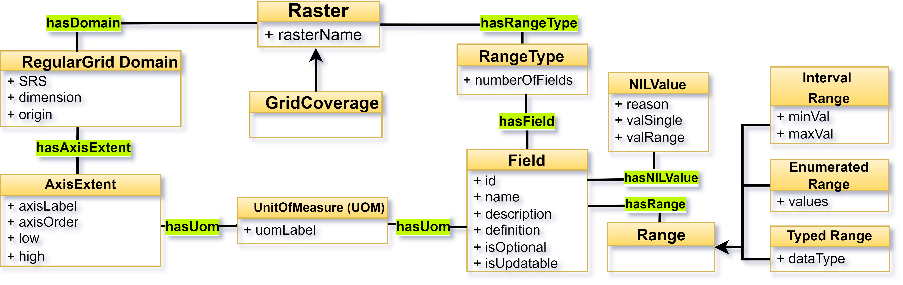
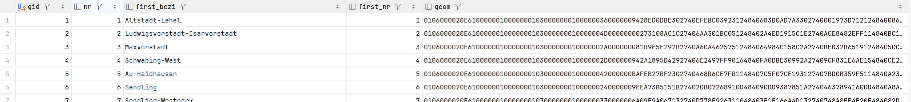
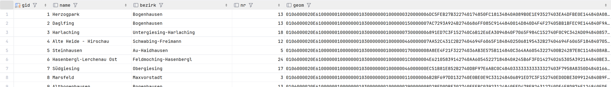
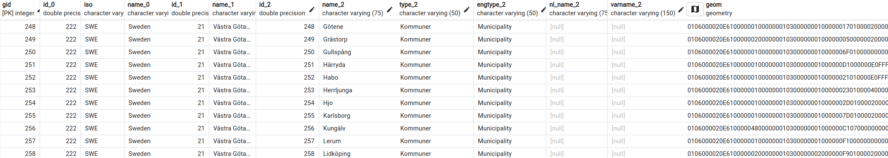
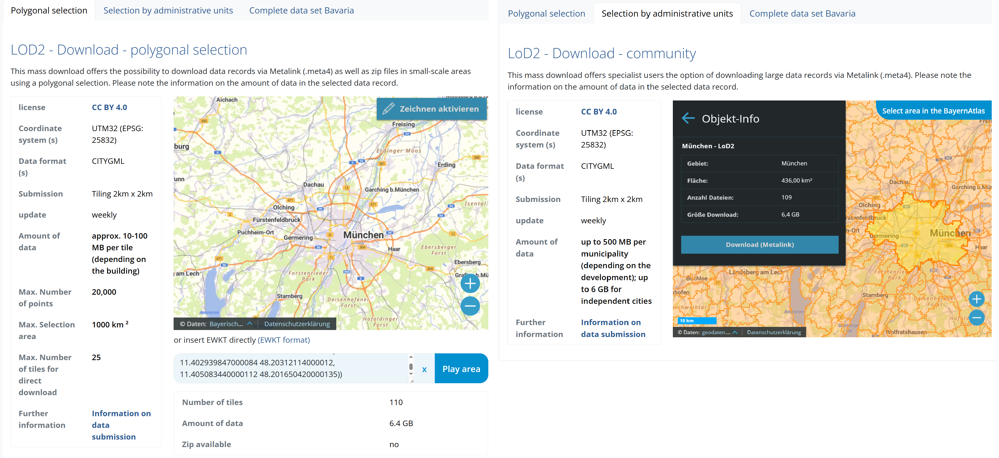
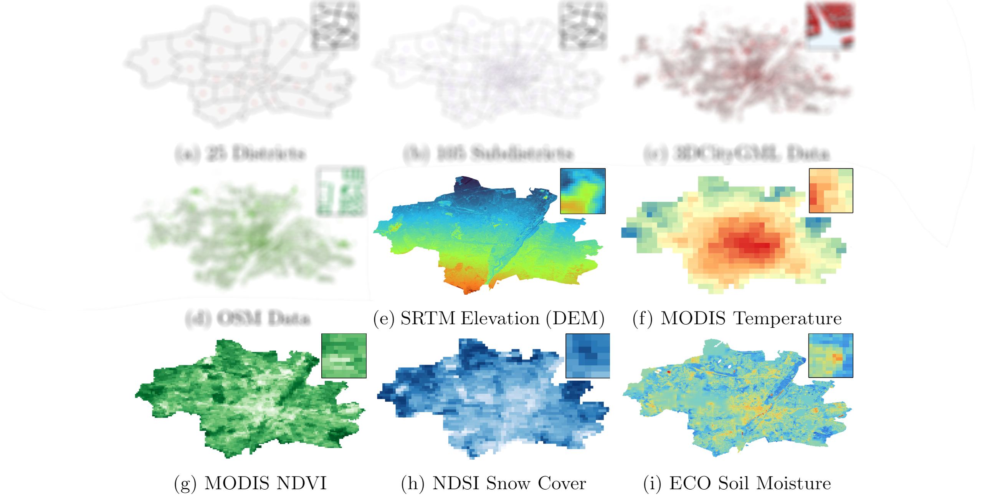
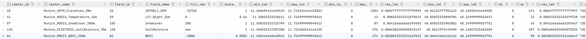

<picture>
  <source media="(prefers-color-scheme: dark)" srcset="diagrams/OntoRaster-Dark.png">
  <source media="(prefers-color-scheme: light)" srcset="diagrams/OntoRaster-Light.png">
  
</picture>

<!-- Raster extension of VKG system Ontop to query over **multidimensional raster** data combined with **relational data**. Current version of OntoRaster supports regular gridded 3-D **raster** data and geometrical **vector data** in geospatial domain. We are constantly improving the extension with new features which will enable the end user to query over raster data and vector data of any domain under the VKG paradigm in future. -->

Demostración de la extensión de **matricial (raster)** del sistema _Virtual Knowledge Graph (VKG)_ **Ontop** para consultar **datos matriciales multidimensionales** integrados con **datos relacionales** en dominios arbitrarios. Actualmente, integra y consulta datos matriciales geoespaciales espaciotemporales de grilla regular junto con datos relacionales, incluyendo datos geométricos **vectoriales**, sobre la marcha. Estamos mejorando constantemente la extensión con nuevas características robustas para permitir a los usuarios finales consultar semánticamente datos matriciales de cualquier dominio bajo el paradigma VKG.

## Características

- 🧠 Integración en tiempo real de datos tabulares heterogéneos, datos geométricos 2D y 3D y datos de $n$ dimensiones en el dominio geoespacial (o cualquier dominio arbitrario) con manejo automático de metadatos durante la ejecución de consultas.
- 🎯 Soporta **RasSPARQL**, un SPARQL extendido con GeoSPARQL y nuevas funciones para datos matriciales.
- 🧮 Adición incremental de nuevas ontologías OWL, bases de datos geoespaciales con sus respectivos mapeos.
- 🗜️ Formatos de datos soportados: `.txt`, `.shp`, `.geojson`, `.geotiff`, `.netcdf`, `.gml`, `json`.
- 🤖 Las respuestas a las consultas son explicables por LLMs (Modelos de Lenguaje Grande), es decir, Ollama, ChatGPT, Claude, etc.
- 🖥️ Interfaz de usuario web limpia y SPARQL YASGUI para demostración de uso.

## Tabla de Contenidos

0. [Motivación](#0-motivation)
1. [Marco de trabajo](#1-framework)
2. [Demo](#2-demo)
3. [Consultas](#3-queries-q)
4. [Ontología (**_O_**)](#4-ontology-o)

- 4.1. [Ontología Matricial](#41-raster-ontology)
- 4.2. [GeoSPARQL v1.1](#42-geosparql-v11)
- 4.3. [GeoNames v3.3](#43-geonames-v33)
- 4.4. [LinkedGeoData](#44-linkedgeodata)
- 4.5. [CityGML v2.0](#45-citygml-v20)
- 4.6. [Cantidades, Unidades, Dimensiones y Tipos (QUDT)](#46-quantities-units-dimensions-and-types-qudt)

5. [Fuentes de Datos Heterogéneos (**_D_**)](#5-heterogenous-data-sources-d)

- 5.1. [Datos Relacionales](#51-relational-data)
  - 5.1.1. [Datos GeoNames](#511-geonames-data)
  - 5.1.2. [Datos Vectoriales (**_D<sup>Vector</sup>_**)](#512-vector-data)
  - 5.1.3. [Datos 3DCityGML (**_D<sup>City3D</sup>_**)](#513-citygml-data-dcity3d)
  - 5.1.4. [Datos OSM (**_D<sup>OSM</sup>_**)](#51-osm-data-dosm)

- 5.2. [Datos Matriciales (**_D<sup>arr</sup>_**)](#52-raster-data-darr)

6. [Mapeos (**_M_**)](#6-mapping-m)
7. [Más detalles](#7-more-details)

## 0. Motivación

- **Consulta** - _Enumera todas las residencias de 30 metros de altura en **Múnich** donde la elevación promedio del terreno sea inferior a **550 metros** y la temperatura promedio de la superficie terrestre supere los **300 K**, dados los siguientes datos heterogéneos._

  

  ¿Cómo puede alguien encontrar una respuesta a esta pregunta si no cuenta con los conocimientos especializados requeridos o experiencia para manejar este tipo de datos espaciales y sus metadatos respectivos?

  😃 **Necesitas **OntoRaster** para resolver esto.** 😃

## 1. Marco de trabajo



<!-- ### 1.1. For more check out the publication

> **Ghosh, A**., Pano, A., Xiao, G., Calvanese, D. [**OntoRaster: Extending VKGs with Raster Data**](https://doi.org/10.1007/978-3-031-72407-7_9). _International Joint Conference on Rules and Reasoning. RuleML+RR 2024. Lecture Notes in Computer Science (LNCS), vol 15183. Springer_, **2024**. -->

## 2. Demo

### 2.1 Clonar este repositorio

- ```sh
  git clone https://github.com/aghoshpro/OntoRaster.git
  ```

### 2.2 Configuración de Docker

- Visita <https://docs.docker.com/desktop/> e instala Docker en tu sistema operativo preferido.

### 2.3 Ejecutar la Demo

- Para esta demostración, asumimos que los puertos `7777`, `7001-7010` (usados para el RDBMS),`8080` (para el Array DBMS), `8082` (usado por Ontop), `6060` (mensaje de éxito y endpoint) están libres. Si necesitas usar puertos diferentes, edita el archivo `.env`.

- Abre la `terminal` o `cmd` y navega al repositorio `OntoRaster`
- Ejecuta lo siguiente:

  ```sh
  docker-compose -f docker-compose.ontoraster.yml up
  ```

- Este comando inicia e inicializa la base de datos relacional **PostgreSQL** con la extensión espacial **PostGIS**. Una vez que la base de datos relacional está lista, la base de datos de matrices **Rasdaman** se inicializa e importa los datos matriciales.

- `NOTA:` Al ejecutar Rasdaman en un contenedor Docker, es importante asegurarse de que tu sistema tenga recursos suficientes (CPU, memoria y espacio en disco) para manejar la importación de archivos matriciales grandes. Si encuentras problemas, como importaciones fallidas, puede deberse a memoria insuficiente u otras restricciones de recursos. Si ocurre este problema, intenta cerrar aplicaciones innecesarias o aumentar los límites de recursos de Docker.

- El archivo `docker-compose` utiliza el mapeo `vkg/OntoRaster.obda` y la ontología `vkg/OntoRaster.owl`.

### 2.4 Endpoint SPARQL de Ontop

Está disponible en <http://localhost:8082/> bajo `success` en Docker Desktop (TCE ~5 min). Haz clic en el enlace y prueba las consultas RasSPARQL como se muestra a continuación,



#### 2.4.1 Editor Yasgui para Consultas RasSPARQL 

<!--  -->


### 2.5 Detener la Demo (opcional)

- Presiona `Ctrl+C` para detener y luego ejecuta lo siguiente,

  ```sh
  docker-compose -f docker-compose.ontoraster.yml down --volumes --rmi all 
  ```

## 3. Consultas (**_Q_**)

Todas las consultas RasSPARQL se encuentran en [`vkg/OntoRaster.toml`](https://github.com/aghoshpro/OntoRaster/blob/main/vkg/OntoRaster.toml).

| **_Q<sub>i</sub>_** | Descripción Funcional                                                                                                                                   |
| ------------------- | -------------------------------------------------------------------------------------------------------------------------------------------------------- |
| **_Q1_**            | ¿Cuál es la dimensión del conjunto de datos matricial de entrada?                                                                                                       |
| **_Q2_**            | Realizar operaciones elemento por elemento sobre las celdas de una matriz de un conjunto de datos matricial de entrada en un sello de tiempo específico con el operador específico del usuario. |
| **_Q3_**            | Encontrar el valor promedio espacial del conjunto de datos matriciales sobre una región vectorial específica del usuario en un sello de tiempo específico                                            |
| **_Q4_**            | Encontrar el valor máximo espacial del conjunto de datos matriciales sobre una región vectorial específica del usuario en un sello de tiempo específico                                            |
| **_Q5_**            | Encontrar el valor mínimo espacial del conjunto de datos matriciales sobre una región vectorial específica del usuario en un sello de tiempo específico                                            |
| **_Q6_**            | Encontrar el valor promedio temporal de un conjunto de datos matriciales específico del usuario sobre una región vectorial específica entre el tiempo de inicio y el tiempo de fin.                  |
| **_Q7_**            | Encontrar el valor máximo temporal de un conjunto de datos matriciales específico del usuario sobre una región vectorial específica entre el tiempo de inicio y el tiempo de fin.                  |
| **_Q8_**            | Encontrar el valor mínimo temporal de un conjunto de datos matriciales específico del usuario sobre una región vectorial específica entre el tiempo de inicio y el tiempo de fin.                  |
| **_Q9_**            | Recortar una porción de datos matriciales específicos del usuario utilizando la geometría de una región vectorial específica en un momento determinado y devolver la matriz recortada        |
| **_Q10_**           | Recortar una porción de datos matriciales específicos del usuario basándose en la forma de una región vectorial personalizada en un momento determinado y devolver matrices filtradas                   |

### 3.1 Resultado de la Consulta

- Encuentra todas las `residencias` y sus respectivos `subdistritos` en Múnich, donde la `elevación` promedio del terreno sea superior a 520 metros

  

  ```SQL
  SELECT ?distName ?elevation ?distWkt ?distWktColor ?bldgWkt ?bldgWktColor {
  ?region a :SubDistrict . 
  ?region rdfs:label ?distName .
  ?region geo:asWKT ?distWkt .
  BIND('#008AFF5C' AS ?distWktColor)
  ?building a lgdo:Residential .
  ?building geo:asWKT ?bldgWkt .
  BIND('red' AS ?bldgWktColor)
  FILTER (geof:sfWithin(?bldgWkt, ?distWkt))
  ?gridCoverage a :Raster .
  ?gridCoverage rasdb:rasterName ?rasterName .
  FILTER (CONTAINS(?rasterName, 'Elevation'))
  BIND ('2000-02-11T00:00:00+00:00'^^xsd:dateTime AS ?timeStamp)
  BIND (rasdb:rasSpatialAverage(?timeStamp, ?distWkt, ?rasterName) AS ?elevation)
  FILTER(?elevation > 520)
  } 
  ```

- Encuentra todos los `rasters` (datos matriciales) dentro de los respectivos `subdistritos` en Múnich basándose en condiciones similares a la consulta anterior [****EN DESARROLLO**]
  <!--  -->
  

    ```SQL
    SELECT ?distName ?elevation ?distWkt ?distWktColor ?bldgWkt ?bldgWktColor {
    ?region a :SubDistrict . 
    ?region rdfs:label ?distName .
    ?region geo:asWKT ?distWkt .
    ?building a lgdo:Residential .
    ?building geo:asWKT ?bldgWkt .
    FILTER (geof:sfWithin(?bldgWkt, ?distWkt))
    ?gridCoverage a :Raster .
    ?gridCoverage rasdb:rasterName ?rasterName .
    FILTER (CONTAINS(?rasterName, 'Elevation'))
    BIND ('2000-02-11T00:00:00+00:00'^^xsd:dateTime AS ?timeStamp)
    BIND (rasdb:rasGeoTIFF(?timeStamp, ?distWkt, ?rasterName) AS ?elevation)
    FILTER(?elevation > 520)
    } 
    ```

## 4. Ontología (**_O_**)

### 4.1. Ontología Matricial

Hemos proporcionado la **Ontología Matricial** que describe información a nivel de metadatos de datos matriciales genéricos de $n$ dimensiones o cubiertas (coverages) basándose en el [Esquema de Implementación de Cubiertas OGC (CIS)](https://docs.ogc.org/is/09-146r8/09-146r8.html) y el artículo [Andrejev et al., 2015](https://www2.it.uu.se/research/group/udbl/publ/DSDIS2015.pdf). Por ahora, solo describe cubiertas de grilla regular o datos matriciales geoespaciales. Las clases _RegularGridDomain_ y _RangeType_ capturan toda la información sobre los dominios y rangos de una cobertura de grilla.



### 4.2. GeoSPARQL v1.1

Para datos vectoriales utilizamos la [Ontología GeoSPARQL v1.1](https://opengeospatial.github.io/ogc-geosparql/geosparql11/index.html), la cual introduce clases como características (features), geometrías y su representación usando Geography Markup Language (GML) y literales Well-Known Text (WKT), e incluye vocabularios de relaciones topológicas. GeoSPARQL también proporciona una extensión de la interfaz de consulta SPARQL estándar, soportando un conjunto de funciones topológicas para el razonamiento cuantitativo.

### 4.3. GeoNames v3.3

La [Ontología GeoNames v3.3](https://www.geonames.org/ontology/documentation.html), parte de la base de datos geográfica [GeoNames](https://www.geonames.org/about.html), hace posible agregar información semántica geoespacial a la World Wide Web (WWW). Consiste en más de 11 millones de topónimos con una URL distintiva que se correlaciona con un servicio web RDF. Fundada por Marc Wick (`marc@geonames.org`), [Unxos GmbH](https://www.unxos.com/), Suiza.

<!-- - Ontology is available at <https://www.geonames.org/ontology/documentation.html> -->

### 4.4. LinkedGeoData

- Define clases de objetos que aparecen en Open Street Map (OSM), como `rutas`, `ferrocarriles`, `servicios`, `infraestructura de emergencia`, `atracciones turísticas`, etc. Esta extensa [ontología](https://github.com/GeoKnow/LinkedGeoData/blob/develop/lgd-ontop-web/lgd.owl), del [Proyecto LinkedGeoData](http://linkedgeodata.org/), comprende más de 400 millones de elementos geográficos distribuidos en 500 clases. Los datos RDF comprenden aproximadamente 20 mil millones de tripletes. Los datos están disponibles según los principios de Datos Vinculados (Linked Data) y están interconectados con DBpedia y GeoNames.

<!-- - Developed by Ontology Engineering Group ([link](https://smartcity.linkeddata.es/ontologies/mapserv.kt.agh.edu.plontologiesosm.owl.html)). -->

- **OSMonto**: Se desarrolló una ontología de etiquetas de OpenStreetMap para facilitar el mantenimiento y la visión general de las etiquetas, así como para permitir el enriquecimiento de la semántica de las etiquetas a través de relaciones con otras ontologías ([Mihai et al 2011](https://www.inf.unibz.it/~okutz/resources/osmonto.pdf)). Fue presentada en State of the Map Europe [SotM-EU'2011](https://stateofthemap.eu/index.html). Visualiza el archivo [.owl](https://raw.githubusercontent.com/doroam/planning-do-roam/master/Ontology/tags.owl) en [Protégé](https://protegeproject.github.io/protege/getting-started/).

<!-- - [Open Street Map integration](https://documentation.researchspace.org/resource/Help:OpenStreetMap) : This integration creates a simple lookup service to federate against the Open Street Maps (OSM) API, allowing users to reference place names in their ResearchSpace instances. Users can lookup a street address, a city, a country etc. and be able to reference this in their data. -->

### 4.5. CityGML v2.0

Desarrollada por [Knowledge Engineering @ CUI](https://cui.unige.ch/isi/ke/ontologies) en la Universidad de Ginebra. En nuestra investigación, la [Ontología CityGML v2.0](https://smartcity.linkeddata.es/ontologies/cui.unige.chcitygml2.0.html) se utiliza para la construcción del KG basándose en datos de edificios 3D CityGML, con modificaciones adicionales e integración de OSM por parte de [Ding et al., 2024](https://doi.org/10.1080/10095020.2024.2337360).

<!-- - Research is undergoing for more efficient integration of 3DCityGML data. -->
- [CityGML 3.0](https://doi.org/10.1007/s41064-020-00095-z) está en proceso para convertirse en un estándar. Sin embargo, **CityGML 2.0** sigue siendo el más popular hasta la fecha para uso práctico e implementación.

### 4.6. Cantidades, Unidades, Dimensiones y Tipos (QUDT)

- [QUDT](https://qudt.org) proporciona un conjunto de vocabularios que representan las propiedades de las clases base y las restricciones utilizadas para modelar cantidades físicas, unidades de medida y sus dimensiones en varios sistemas de medición, originalmente desarrollados para los Modelos de Ontología de Iniciativas de Exploración de la NASA ([NExIOM](https://step.nasa.gov/pde2009/slides/20090506145822/PDE2009-NExIOM-TQ_v2.0-aRH-sFINAL.pdf)) y ahora forma la base del [Libro de Manual QUDT de la NASA](http://ontolog.cim3.net/file/work/OntologyBasedStandards/2013-10-10_Case-for-QUOMOS/NASA-QUDT-Handbook-v10--RalphHodgson_20131010.pdf).
- QUDT tiene como objetivo mejorar la interoperabilidad de los datos y la especificación de estructuras de información a través de estándares industriales para `Unidades de Medida (UoM)`, tipos de cantidad, dimensiones y Tipos de datos ([Ray et al., 2011](https://doi.org/10.25504/FAIRsharing.d3pqw7)).

## 5. Fuentes de Datos Heterogéneos (**_D_**)

### Área de Interés (AOI)

- **Múnich**, la capital de Baviera, Alemania, cubre aproximadamente **334.00** $km^2$, incluyendo la ciudad y el área circundante. Esta zona está densamente poblada, por lo que presenta numerosas estructuras que abarcan múltiples zonas residenciales y comerciales junto con servicios públicos, consolidándola como un bullicioso centro de negocios. Además, se alinea con nuestra colaboración con la TU Munich bajo el Proyecto DFG [Dense and Deep Geographic Virtual Knowledge Graphs for Visual Analysis (D2G2)](https://gepris.dfg.de/gepris/projekt/500249124).

- \***\*NOTA** - Cualquier AOI específica del usuario con tipos similares de datos puede utilizarse agregando las afirmaciones de mapeo relevantes.

### 5.1 Datos Relacionales


### 5.1.1. Datos GeoNames

Contiene más de **12 millones** de características geográficas únicas con sus 25 millones de nombres, incluyendo nombres alternativos y traducidos (16 millones), población, zona horaria, coordenadas geográficas (lat/long en WGS84), etc., recopilados de varias **[fuentes de datos](https://www.geonames.org/datasources/)**. Todas las características se clasifican en una de **9 clases de características**, por ejemplo, **A, H, L, P, R, S, T, U, V**, y se subdividen aún más en uno de los **[645 códigos de características](https://www.geonames.org/export/codes.html)**. Los datos están disponibles para cada país en **[aquí](https://www.geonames.org/export/)**.

|Clases de características|Códigos de características|
|----------------|------------------------|
| **A** (país, estado, región,...) | `A.ADM1` - Región Administrativa 1, `A.ADM2` - Región Administrativa 2, `TERR` - Territorio, `ZN` - Zona|
| **H** (arroyo, lago, ...)          | `H.ANCH` - Ancoraje, `H.FISH` - Área de Pesca, `H.LKS` - Lagos|
| **L** (parques, área, ...)            | `L.RGN`- Región, `L.CONT` - Continente, `L.AREA` - Área|
| **P** (ciudad, aldea,...)          | `P.PPL` - Lugar habitado, `P.PPLC` -  Capital de una entidad política |
| **R** (carretera, ferrocarril)             | `R.ST` - Calle, `R.RD` -Carretera, `R.RR` - Ferrocarril|
| **S** (punto, edificio, granja)       | `S.UNIV`- Universidad, `S.SCH`- Escuela, `S.RSTN` - Estación de Ferrocarril, `S.AIRP` -Aeropuerto|
| **T** (montaña, colina, roca,...)     | `T.DSRT`- Desierto, `T.MT` - Montaña, `T.PEN` - Península|
| **U** (submarino)                   | `U.BDLU` - Tierra fronteriza, `U.MTU` - Montaña|
| **V** (bosque, brezal,...)           | `V.FRST`- Bosques, `V.GRSLD` - Pastizal|

### 5.1.2. Datos Vectoriales

- Esta demostración utilizó 25 distritos, 105 subdistritos, datos de OpenStreetMap (OSM) y datos de edificios 3D CityGML como datos vectoriales para Múnich, como se muestra arriba en la **Figura (a)-(d)**.

<!-- , downloaded from [arcgis](https://www.arcgis.com/home/item.html?id=369c18dfc10d457d9d1afb28adcc537b). -->

- Almacenados en dos tablas separadas como `munich_dist25` y `munich_dist105` en la base de datos **VectorTablesDB** dentro de **PostgreSQL** con la extensión espacial **PostGIS**. Las capturas se muestran a continuación,

- `munich_dist25` 

- `munich_dist105` 

- Esta demostración también posee los municipios de Suecia, Baviera (Alemania) y Alto Adigio (Italia) como **Áreas de Interés (AOIs)**, que comprenden aproximadamente **500** regiones distintas con características geométricas variadas, es decir, enclaves, islas con otros atributos. Por ejemplo, la tabla para Suecia es la siguiente,

  - `region_sweden` 

  - Lo mismo aplica para `region_bavaria` y `region_south_tyrol`. Revisa esta rama [`ontoraster/PaperRuleML'24`](https://github.com/aghoshpro/OntoRaster/tree/ontoraster/Paper%40RuleML'24) para más información.

---

### 5.1.3. Datos CityGML (**_D<sup>City3D</sup>_**)

#### 5.1.3.1. Instalación de 3DCityDB

- Verifica la versión de Java 11 o superior

- Sigue las [instrucciones](https://3dcitydb-docs.readthedocs.io/en/latest/first-steps/install-impexp.html) para instalar el esquema **3DCityDB** que contendrá los datos **CityGML** en el RDBMS

- Ve a [3DCityDB](https://www.3dcitydb.org/3dcitydb/downloads/) y descarga el archivo instalador `.jar` del [Importador/Exportador](https://3dcitydb-docs.readthedocs.io/en/latest/first-steps/setup-3dcitydb.html#installation-steps-on-postgresql)

- Configura el esquema **3DCityDB** para PostgreSQL según las instrucciones de [aquí](https://3dcitydb-docs.readthedocs.io/en/latest/first-steps/setup-3dcitydb.html#installation-steps-on-postgresql)

- Ejecución del Importador/Exportador [enlace](https://3dcitydb-docs.readthedocs.io/en/latest/impexp/launching.html#launching-the-importer-exporter)

- Inicia el Asistente GUI de 3DCityDB

  > $ chmod u+x 3DCityDB-Importer-Exporter && ./3DCityDB-Importer-Exporter

#### 5.1.3.2. Obtención de Datos

- **GUI** - Primero verifica cuántos archivos gml LOD2 son necesarios para cubrir el **AOI** mencionado anteriormente

  - Ve a [OpenData](https://geodaten.bayern.de/opengeodata/OpenDataDetail.html?pn=lod2&active=MASSENDOWNLOAD) y sube el texto desde `./citygml_data/Munich_EWKT.txt` que contiene la geometría del AOI en formato `EWKT`.

  - Esto generará un archivo `./citygml_data/lod2.meta4` que contiene todos los archivos `.gml` con sus respectivos enlaces.

  - A continuación se muestran dos formas de proceder utilizando la GUI.

    <div align="center">
      
    </div>

- **CLI** - Para la demostración utilizamos el script `./citygml_data/get.munich_citygml.sh` (ver abajo), el cual puede ejecutarse en la `terminal` (Linux) o `gitbash` (Windows) para descargar los **110** archivos `.gml` (~ **6.4 GB**). .

    ```sh
    #!/bin/bash
    for LONG in `seq 674 2 702`
    do
      for LAT in `seq 5328 2 5346`
      do
        wget "https://download1.bayernwolke.de/a/lod2/citygml/${LONG}_${LAT}.gml"
      done
    done
    ```

#### 5.1.3.3. Visualizar Datos CityGML como CityJSON

- [CityJSON](https://www.cityjson.org) es un codificado basado en JSON para almacenar modelos de ciudades en 3D.
- Conversión de CityGML a CityJSON [aquí](https://www.cityjson.org/tutorials/conversion/)
- Arrastra el archivo `.json` convertido al visor oficial en línea de CityJSON llamado [ninja](https://www.cityjson.org/tutorials/getting-started/#visualise-it).

#### 5.1.2.4. Manipular archivos CityJSON usando CityJSON/io (cjio)

- [clio](https://www.cityjson.org/tutorials/getting-started/#manipulate-and-edit-it-with-cjio) es un programa de interfaz de línea de comandos utilizado para editar, unir y validar archivos CityJSON.

- Se requiere Python (versión >3.7) y se instala usando pip `pip install cjio`.

---

### 5.1.4. Datos OSM (**_D<sup>osm</sup>_**)

#### Descarga de Datos

- [Extractos de Datos OpenStreetMap de GeoFabrik](https://download.geofabrik.de) : Selecciona tu área de interés (AOI) y descarga los datos OSM en varios formatos como `.osm`, `.pfb`, `.shp`.

- También puedes usar herramientas CLI como `wget` o `curl` si tienes el Cuadro Delimitador (BBOX) del AOI
  - **BBOX** : [11.3608770000001300,48.0615539900001068,11.7230828880000786,48.2481460580001453]
  - _izquierda,inferior,derecha,superior_
  - _minLongitud , minLatitud , maxLongitud , maxLatitud_
  - _oeste,sur,este,norte_
  - _xmin,ymin,xmax,ymax_
  - OSM [Docs](https://wiki.openstreetmap.org/wiki/Bounding_box)

- Revisa [bboxfinder.com](http://bboxfinder.com/#0.000000,0.000000,0.000000,0.000000) para encontrar el BBOX de tu AOI

#### AOI Pequeño

-

  ```sh
  wget -O Munich.osm "https://api.openstreetmap.org/api/0.6/map?bbox=11.2871,48.2697,11.9748,47.9816"
  ```

#### AOI GRANDE (>300 MB)

-

  ```sh
  wget -O Munich.osm "http://overpass.openstreetmap.ru/cgi/xapi_meta?*[bbox=11.3608770000001300,48.0615539900001068,11.7230828880000786,48.2481460580001453]"
  ```

---

### 5.2 Datos Matriciales (**_D<sup>arr</sup>_**)



- La **Figura (e)-(i)** muestra los respectivos datos matriciales sobre Múnich, que incluyen elevación, temperatura de la superficie terrestre, vegetación, cobertura de nieve y humedad del suelo desde diferentes sensores satelitales.

- Almacenados en el DBMS de matrices [**RasDaMan**](https://doc.rasdaman.org/index.html) ("Gestor de Datos Matriciales").

<!-- - Information about the Raster data can be found at NASA's [Earth Science Data Systems (ESDS)](https://lpdaac.usgs.gov/products/mod11a1v061/)

  - Demo data used for Sweden, Bavaria and South Tyrol can be downloaded direclty from [Google Drive](https://drive.google.com/drive/folders/1yCSmmok3Iz7J2lZ-uleCg_q87GZsHfI7?usp=sharing) -->

- Los metadatos de los rasters se almacenan en la tabla `raster_lookup` como se muestra a continuación.
- `raster_lookup` 

  | raster\_id | raster\_name | field\_id | field\_name | fill\_nan | scale\_factor | min\_lon | max\_lon | min\_lon\_grid | max\_lon\_grid | res\_lon | min\_lat | max\_lat | min\_lat\_grid | max\_lat\_grid | res\_lat | start\_time | end\_time | start\_time\_grid | end\_time\_grid | res\_time |
  | :--- | :--- | :--- | :--- | :--- | :--- | :--- | :--- | :--- | :--- | :--- | :--- | :--- | :--- | :--- | :--- | :--- | :--- | :--- | :--- | :--- |
  | 18 | Sweden\_Surface\_Temperature | 36 | LST\_Night\_1km | 0 | 0.02 | 10.958333332351629 | 24.174999997834277 | 0 | 1585 | 0.00833333333258679 | 55.333333328376284 | 69.06666666047931 | 0 | 1647 | 0.008333333332586788 | "2022-03-31T12:00:00+00:00" | "2022-11-15T12:00:00+00:00" | 0 | 228 | 1 |
  | 41 | Bavaria\_Temperature\_MODIS\_1km | 59 | LST\_Night\_1km | 0 | 0.02 | 8.974999999195973 | 13.841666665426658 | 0 | 583 | 0.00833333333258679 | 47.26666666243227 | 50.56666666213664 | 0 | 395 | 0.008333333332586797 | "2022-12-31T12:00:00+00:00" | "2023-10-31T12:00:00+00:00" | 0 | 303 | 1 |
  | 64 | South\_Tyrol\_Temperature\_MODIS\_1km | 82 | LST\_Night\_1km | 0 | 0.02 | 10.38333333240314 | 12.483333332215011 | 0 | 251 | 0.008333333332586793 | 46.216666662526336 | 47.099999995780536 | 0 | 105 | 0.008333333332586762 | "2022-12-31T12:00:00+00:00" | "2023-11-01T12:00:00+00:00" | 0 | 304 | 1 |
  | 87 | Munich\_SRTM\_Elevation\_30m | 105 | SRTMGL1\_DEM | -32768 | 1 | 11.360694444453532 | 11.723194444453823 | 0 | 1304 | 0.0002777777777779992 | 48.06152777781623 | 48.24819444448305 | 0 | 671 | 0.000277777777777997 | "2000-02-10T12:00:00+00:00" | "2000-02-11T12:00:00+00:00" | 0 | 0 | 1 |
  | 110 | Munich\_MODIS\_Temperature\_1km | 128 | LST\_Night\_1km | 0 | 0.02 | 11.35833333230611 | 11.724999998939616 | 0 | 43 | 0.008333333332579674 | 48.05833332898704 | 48.24999999563637 | 0 | 22 | 0.008333333332579728 | "2021-12-31T12:00:00+00:00" | "2024-11-07T12:00:00+00:00" | 0 | 1041 | 1 |
  | 133 | Munich\_MODIS\_NDVI\_250m | 151 | NDVI | -3000 | 0.0001 | 11.360416665648941 | 11.724999998949613 | 0 | 174 | 0.0020833333331467013 | 48.06041666236116 | 48.24999999567751 | 0 | 90 | 0.0020833333331466667 | "2021-12-11T00:00:00+00:00" | "2024-10-23T00:00:00+00:00" | 0 | 65 | 16 |
  | 156 | Munich\_MODIS\_SnowCover\_500m | 174 | SnowCover | 200 | 1 | 11.358333332315794 | 11.724999998949613 | 0 | 87 | 0.004166666666293403 | 48.05833332902802 | 48.24999999567751 | 0 | 45 | 0.004166666666293467 | "2023-11-30T12:00:00+00:00" | "2024-11-30T12:00:00+00:00" | 0 | 365 | 1 |
  | 179 | Munich\_ECOSTRESS\_SoilMoisture\_70m | 197 | SoilMoisture | nan | 1 | 11.360555257287388 | 11.723286514146125 | 0 | 576 | 0.0006286503585073437 | 48.0612374476909 | 48.24857525452609 | 0 | 297 | 0.0006286503585073535 | "2024-05-20T06:13:26+00:00" | "2024-10-25T18:48:56+00:00" | 0 | 158 | 1 |
  


- Idealmente, cualquier dato matricial de grilla 3-D del dominio geoespacial debería funcionar con la adición de los mapeos relevantes.

## 6. Mapeo (**_M_**)

El diseño de mapeos es el paso más crucial centrado en el usuario para generar un Grafo de Conocimiento Virtual (VKG), ya que conecta los datos crudos con la ontología de dominio respectiva para generar el grafo de conocimiento durante la consulta del usuario.

- Un mapeo consiste en tres partes principales: un id de mapeo, una fuente y un destino.

  - **ID de Mapeo** es un identificador arbitrario pero único
  - **Fuente** se refiere a una consulta SQL regular expresada sobre una base de datos relacional que extrae los datos de la tabla usando el nombre de columna elegido.
  - **Destino** es un patrón de triple RDF que utiliza las variables de respuesta de la consulta SQL precedente como marcadores de posición y se describe usando la [sintaxis Turtle](https://github.com/ontop/ontop/wiki/TurtleSyntax)

#### Revisa los mapeos en [`vkg/OntoRaster.obda`](https://github.com/aghoshpro/OntoRaster/blob/main/vkg/OntoRaster.obda)
<!-- 
### 6.1. **Relational Data (including `Vector`)**

**Area of Interest (AOI)** contains one or more regions. **_Region_** can be a super-class that includes any type of real world ***feature classes*** such as administrative boundaries  e,g., `municipalities`, `districts`, `sub-districts`,`provinces`,`countries` or any user specific `custom region`. Here we have only provided the mapping for 25 districts of Munich (`munich_dist25` table).

#### **_M1 - `regionId`_ of District Class**
- Target

  ```sparql
  :vector/bavaria/munich/districts/{regionId} a :District .
  ```

- Source

  ```sql
  SELECT gid AS regionId FROM public.munich_dist25
  ```

#### **_M2 - `regionName`_ of District Class**

- Target

  ```sparql
  :vector/bavaria/munich/districts/{regionId} rdfs:label {regionName}^^xsd:string .
  ```

- Source

  ```sql
  SELECT gid AS regionId, first_bezi AS regionName FROM public.munich_dist25
  ```
#### **_M3 - `regionGeometry`_ of District Class**

- **Target**

  ```sparql
  :vector/bavaria/munich/districts/{regionId} geo:asWKT {regionWkt}^^geo:wktLiteral .
  ```

- **Source**

  ```sql
  SELECT SELECT gid AS regionId,,
              CASE
                  WHEN ST_NumGeometries(geom) = 1 THEN ST_AsText(ST_GeometryN(geom, 1))
                  ELSE ST_AsText(geom)
              END AS regionWkt
  FROM public.munich_dist25
  ```

- Please check `vkg/OntoRaster.obda` for rest of the mappings for `subdistricts`, `osm_buildings` and `3dcitygml` buildings.

### 6.2. **Raster Metadata**

#### **_M11 - `rasterId`_ of Raster Class**

- **Target**

  ```sparql
  :raster/{rasterId} a :Raster .
  ```

- **Source**

  ```sql
  SELECT raster_id AS rasterId FROM raster_lookup
  ```

#### **_M12 - `rasterName`_ of Raster Class**

- **Target**

  ```sparql
  :raster/{rasterId} rasdb:rasterName {rasterName}^^xsd:string .
  ```

- **Source**

  ```sql
  SELECT raster_id AS rasterId, raster_name AS rasterName FROM raster_lookup
  ``` -->

## 7. Más detalles

Por favor, visita el sitio web oficial de Ontop <https://ontop-vkg.org> para más detalles sobre Grafos de Conocimiento Virtuales y <https://doc.rasdaman.org/index.html> para más detalles sobre bases de datos de matrices.
