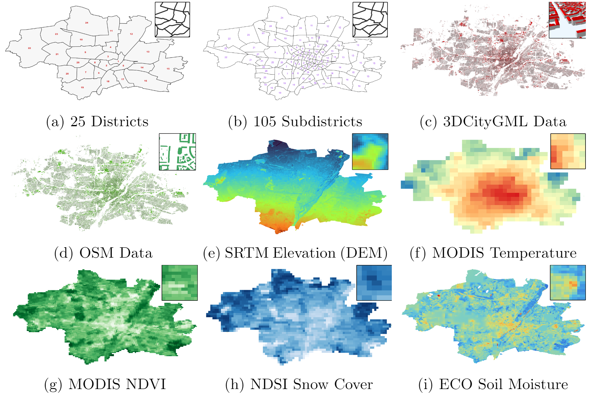
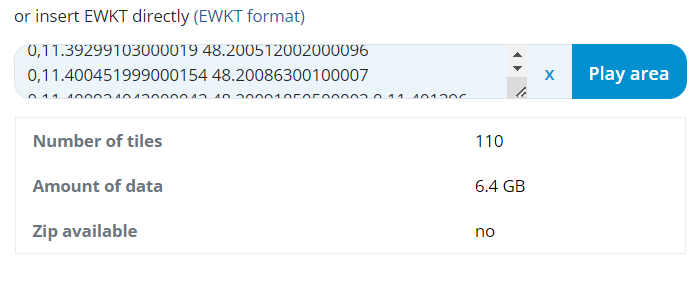

<!-- <picture>
  <source media="(prefers-color-scheme: dark)" srcset="https://github.com/aghoshpro/OntoRaster/assets/71174892/21fee824-3011-4a80-9225-77fc92f3a153">
  <source media="(prefers-color-scheme: light)" srcset="https://github.com/aghoshpro/OntoRaster/assets/71174892/a93cd5f8-cb1b-441b-acaf-415deb089d3b">
  
</picture> -->

<picture>
  <source media="(prefers-color-scheme: dark)" srcset="diagrams/OntoRaster-Dark.png">
  <source media="(prefers-color-scheme: light)" srcset="diagrams/OntoRaster-Light.png">
  
</picture>

<!-- Raster extension of VKG system Ontop to query over **multidimensional raster** data combined with **relational data**. Current version of OntoRaster supports regular gridded 3-D **raster** data and geometrical **vector data** in geospatial domain. We are constantly improving the extension with new features which will enable the end user to query over raster data and vector data of any domain under the VKG paradigm in future. -->

Raster extension of _Virtual Knowledge Graph (VKG)_ system Ontop to query over **multidimensional raster** data in conjunction with **relational data** in arbitrary domains. Currently it integrates and queries regular gridded (geo) spatial-temporal **raster** data [OGC Coverage] together with relational data including **vector** geometrical data, **OpenStreetMap (OSM)** data and **3DCityGML** data. We're constantly enhancing the extension with new robust features to allow the end users to semantically query integrated raster data with relational data of arbitrary domain under the VKG paradigm.

## Table of Contents

0. [Motivation](#0-motivation)
1. [Framework](#1-framework)
2. [Demo](#2-demo)
3. [Queries](#3-queries-q)
4. [Ontology (**_O_**)](#4-ontology-o)

- 4.1. [Raster Ontology](#41-raster-ontology)
- 4.2. [GeoSPARQL Ontology v1.1](#42-geosparql-v11)
- 4.3. [CityGML v2.0](#43-citygml-v20)
- 4.4. [Quantities, Units, Dimensions and Types (QUDT) Ontology](#44-quantities-units-dimensions-and-types-qudt)
- 4.5. [OpenStreetMap (OSM) Ontology](#45-open-street-map-osm-ontology)

5. [Heterogenous Data Sources (**_D_**)](#5-heterogenous-data-sources-d)

- 5.1. [Relational Data (**_D<sup>rel</sup>_**)](#51-relational-data)

  - 5.1.1. [Vector Data (**_D<sup>Vector</sup>_**)](#511-vector-data)
  - 5.1.2. [3DCityGML Data (**_D<sup>City3D</sup>_**)](#512-citygml-data-dcity3d)
  - 5.1.2. [OSM Data (**_D<sup>OSM</sup>_**)](#513-osm-data-dosm)

- 5.2. [Raster Data (**_D<sup>arr</sup>_**)](#52-raster-data-darr)

6. [Mappings (**_M_**)](#6-mapping-m)
7. [More details](#7-more-details)

## 0. Motivation

- **Query** - _List all the 30 meters tall residentials in Munich where average terrain elevation less than **550 meters** and average land surface temperature is over **300K**, given the following heterogenous data_.

  

  How can someone find an answer to this question if they don't have the required domain knowledge or expertise regarding to handle these many types of spatial data and their respective metadata.

  😃 **You need **OntoRaster** to solve this.** 😃

## 1. Framework


### 1.1. For more check out the publication

> **Ghosh, A**., Pano, A., Xiao, G., Calvanese, D. [**OntoRaster: Extending VKGs with Raster Data**](https://doi.org/10.1007/978-3-031-72407-7_9). _International Joint Conference on Rules and Reasoning. RuleML+RR 2024. Lecture Notes in Computer Science (LNCS), vol 15183. Springer_, **2024**.

## 2. Demo

### 2.1 Clone this repository

<!-- - Windows

  ```sh
  git clone https://github.com/aghoshpro/OntoRaster  --config core.autocrlf=input
  ```

- MacOS and Linux: -->

  ```sh
  git clone https://github.com/aghoshpro/OntoRaster.git
  ```

### 2.2 Setup Docker

- Go to <https://docs.docker.com/desktop/> and install docker on your favourite OS.

### 2.3 Run the demo

- For this demo, we assume that the ports `7777`, `7001-7010` (used for the RDBMS),`8080` (for Array DBMS), `8082` (used by Ontop), `6060` (prompt success msg and endpoint) are free. If you need to use different ports, please edit the file `.env`.

- Open `terminal` or `cmd` and navigate to the `OntoRaster` repository
- Run the following:

  ```sh
  docker-compose -f docker-compose.ontoraster.yml up
  ```

- This command starts and initializes the relational database **PostgreSQL** with the spatial extension **PostGIS**. Once the relational database is ready, the array database **Rasdaman** initiates and imports the raster data.

- `NOTE:` When running Rasdaman in a Docker container, it's important to ensure that your system has sufficient resources (CPU, memory, and disk space) to handle large raster file imports. If you encounter issues, such as failed imports, it may be due to insufficient available memory or other resource constraints. If this issue occurs try closing unnecessary applications or increase docker resource limits.

- `docker-compose` file uses the mapping `vkg/OntoRaster.obda` and ontology `vkg/OntoRaster.owl`.

### 2.4 Ontop SPARQL Endpoint

It becomes available at <http://localhost:8082/> under `success` in docker desktop (ETC 5 min). Click the link and try out the RasSPARQL queries as shown below,


#### 2.4.1 RasSPARQL Query Editor

<!--  -->


## 3. Queries (**_Q_**)

All RasSPARQL queries described below are also available at `vkg/OntoRaster.toml`.

| **_Q<sub>i</sub>_** | Description                                                                                                                                              |
| ------------------- | -------------------------------------------------------------------------------------------------------------------------------------------------------- |
| **_Q1_**            | What is the dimension of the input raster dataset?                                                                                                       |
| **_Q2_**            | Perform element-wise operation over cells of an array of an input raster dataset at a particular timestamp with the user-specific operator and operator. |
| **_Q3_**            | Find spatial average value from the raster dataset over a user-specific vector region at a specific timestamp                                            |
| **_Q4_**            | Find spatial maximum value from the raster dataset over a user-specific vector region at a specific timestamp                                            |
| **_Q5_**            | Find spatial minimum value from the raster dataset over a user-specific vector region at a specific timestamp                                            |
| **_Q6_**            | Find the temporal average value from a user-specific raster dataset over a user-specific vector region between start time and end time.                  |
| **_Q7_**            | Find the temporal maximum value from a user-specific raster dataset over a user-specific vector region between start time and end time.                  |
| **_Q8_**            | Find the temporal minimum value from a user-specific raster dataset over a user-specific vector region between start time and end time.                  |
| **_Q9_**            | Clip a portion of user-specific raster data using the geometry of a user-specific vector region at a particular time and return the clipped array        |
| **_Q10_**           | Clip a portion of user-specific raster data based on the shape of custom vector region at a particular time and return filtered arrays                   |

### 3.1 Query Result

- Find all the `residentials` and respective `sub-districts` in Munich, where the average terrain elevation is above 520 meters


```SQL
PREFIX : <https://github.com/aghoshpro/OntoRaster/> 
PREFIX rdfs: <http://www.w3.org/2000/01/rdf-schema#>
PREFIX geo: <http://www.opengis.net/ont/geosparql#>
PREFIX rasdb: <https://github.com/aghoshpro/RasterDataCube/>

SELECT ?bldgName ?subdistName ?elevation 
{ 
  ?region a :SubDistrict ; rdfs:label ?subdistName ; geo:asWKT ?subdistWkt .
  ?bldg a lgdo:Residential ; rdfs:label ?bldgName ; geo:asWKT ?bldgWkt .
  FILTER (geof:sfWithin(?bldgWkt, ?subdistWkt))
  ?gridCoverage a :Raster ; rasdb:rasterName ?rasterName .
  FILTER (CONTAINS(?rasterName, 'Elevation'))
  BIND ('2000-02-11T00:00:00+00:00'^^xsd:dateTime AS ?timeStamp)
  BIND (rasdb:rasSpatialAverage(?timeStamp, ?subdistWkt, ?rasterName)
  AS ?elevation)
  FILTER(?elevation > 520)
} 
```

## 4. Ontology (**_O_**)

### 4.1. Raster Ontology

We have provided **Raster Ontology** ontology that describe meta-level information of $n-dimensional$ generic raster data or coverage based on the [OGC Coverage Implementation Schema (CIS)](https://docs.ogc.org/is/09-146r8/09-146r8.html) and the paper [Andrejev et al., 2015](https://www2.it.uu.se/research/group/udbl/publ/DSDIS2015.pdf). As of now it only describes only regular gridded coverage or geospatial raster data. The _RegularGridDomain_ and _RangeType_ classes capture all the information about the domains and ranges of a grid coverage.


### 4.2. GeoSPARQL v1.1

For vector data we are using [GeoSPARQL v1.1 Ontology](https://opengeospatial.github.io/ogc-geosparql/geosparql11/index.html) introduces classes likes features, geometries, and their representation using Geography Markup Language (GML) and Well-Known Text (WKT) literals, and includes topological relationship vocabularies. GeoSPARQL also provides an extension of the standard SPARQL query interface, supporting a set of topological functions for quantitative reasoning.

### 4.3. CityGML v2.0

We are also using [CityGML v2.0 Ontology](https://cui.unige.ch/isi/ke/ontologies) developed by the University of Geneva for the ontology component of the KG construction phase and further modified by [Ding et al., 2024](https://doi.org/10.1080/10095020.2024.2337360) by adding further classes on addresses (including xAL) and removing object properties with the same IRI as data properties.

### 4.4. Quantities, Units, Dimensions and Types (QUDT)

The [QUDT](https://qudt.org) provides set of vocabularies representing the base classes properties, and restrictions used for modeling physical quantities, measurement units, and their dimensions in various measurement systems originally developed for the NASA Exploration Initiatives Ontology Models ([NExIOM](https://step.nasa.gov/pde2009/slides/20090506145822/PDE2009-NExIOM-TQ_v2.0-aRH-sFINAL.pdf)) project and now it forms the basis of the [NASA QUDT Handbook](http://ontolog.cim3.net/file/work/OntologyBasedStandards/2013-10-10_Case-for-QUOMOS/NASA-QUDT-Handbook-v10--RalphHodgson_20131010.pdf). QUDT aims to improve interoperability of data and the specification of information structures through industry standards for `Units of Measure (UoM)`, Quantity Kinds, Dimensions and Data Types as pointed out by [Ray et al., 2011](https://doi.org/10.25504/FAIRsharing.d3pqw7). This OWL schema is a foundation for a basic treatment of units which is considered for `Unit of Measurement (UoM)` in this work.

### 4.5. Open Street Map (OSM) ontology

- Defines classes of objects appearing on maps: roads, railways, water ways, amenities, emergency infrastructure, public transport, shops, tourist attractions, etc. This extensive ontology comprises over 660 classes, delineated according to the established set of OSM tags and their corresponding values. It was developed by Ontology Engineering Group ([link](https://smartcity.linkeddata.es/ontologies/mapserv.kt.agh.edu.plontologiesosm.owl.html)).

- **OSMonto**: An ontology of OpenStreetMap tags, created with the purpose to ease maintenance and overview of existing tags and to allow enriching the semantics of tags by relating them to other ontologies. It has been developed as a research paper [Mihai et al 2011](https://www.inf.unibz.it/~okutz/resources/osmonto.pdf) at University Bremen and DFKI Bremen and was presented at State of the Map Europe [SotM-EU'2011](https://stateofthemap.eu/index.html) and . An [.owl](https://raw.githubusercontent.com/doroam/planning-do-roam/master/Ontology/tags.owl) file containing the OSMonto ontology can be viewed in Protégé.

- [Open Street Map integration](https://documentation.researchspace.org/resource/Help:OpenStreetMap) : This integration creates a simple lookup service to federate against the Open Street Maps (OSM) API, allowing users to reference place names in their ResearchSpace instances. Users can lookup a street address, a city, a country etc. and be able to reference this in their data.

## 5. Heterogenous Data Sources (**_D_**)

Our **area of interest (AOI)** encompasses the city of Munich, the capital and largest city of Bavaria, Germany, covering approximately 311.20 $km^2$ including the city and the surrounding area. This area is densely populated, hence features numerous structures encompassing numerous  residential and commercial zones alongside public amenities, establishing it as a bustling business hub. Also, it aligns with our collaboration with TU Munich under the DFG Project `D2G2`

<!-- We selected Munich, the capital and largest city of Bavaria State, Germany as our area of interest (AOI) which comprises an approximate area of 311.20 $km^2$ including the city and the surrounding metropolitan area. This area is densely populated and hence features numerous structures encompassing residential and commercial zones. -->

\***\*NOTE** - Any other AOI with similar kinds of data can be used.

### 5.1 Relational Data


### 5.1.1. Vector Data

- This demo utilised 25 districts, 105 sub-districtsm OpenstreetMap (OSM) buildings and 3DCityGML 3D buildings data of Munich as our vector data as displayed above in figure (a)-(d).

<!-- , downloaded from [arcgis](https://www.arcgis.com/home/item.html?id=369c18dfc10d457d9d1afb28adcc537b). -->

- Stored in two separate tables such as `munich_dist25`, `munich_dist105` in **VectorTablesDB** database inside **PostgreSQL** with spatial extension **PostGIS**. Snapshots are dispayed below,

- `munich_dist25` 

- `munich_dist105` 

- Another demo at this branch [`ontoraster/PaperRuleML'24`](https://github.com/aghoshpro/OntoRaster/tree/ontoraster/Paper%40RuleML'24) posses municipalities of Sweden, Bavaria (Germany), and South Tyrol (Italy) as **Areas of Interest (AOI)** which comprises approx 500 distinct regions with varying geometry features i.e., enclaves, islands with other attributes. For instance, the table for Sweden is as follows,

  - `region_sweden` 

  - Same goes for `region_bavaria` and `region_south_tyrol`.

- Ideally any user-specific vector data for any AOI will work by adding relevant mappings.

---

### 5.1.2. CityGML Data (**_D<sup>City3D</sup>_**)

#### 5.1.2.1. Installing 3DCityDB

- Check Java version 11 or higher

- Follow the [instructions](https://3dcitydb-docs.readthedocs.io/en/latest/first-steps/install-impexp.html) to install **3DCityDB** schema that will contain **CityGML** data in RDBMS

- Go to [3DCityDB](https://www.3dcitydb.org/3dcitydb/downloads/) and download the [Importer/Exporter](https://3dcitydb-docs.readthedocs.io/en/latest/first-steps/setup-3dcitydb.html#installation-steps-on-postgresql) installer `.jar` file

- Set up **3DCityDB** schema for PostgreSQL as per the instructions [here](https://3dcitydb-docs.readthedocs.io/en/latest/first-steps/setup-3dcitydb.html#installation-steps-on-postgresql)

- Launching Importer/Exporter [link](https://3dcitydb-docs.readthedocs.io/en/latest/impexp/launching.html#launching-the-importer-exporter)

- Start the 3DCityDB GUI Wizard

  > $ chmod u+x 3DCityDB-Importer-Exporter && ./3DCityDB-Importer-Exporter

#### 5.1.2.2. Get Data

- Area of Interest : **Munich Metropolitan Area**

- To check how many LOD2 gml files are needed to cover the aforementioned AOI one may go to [OpenData](https://geodaten.bayern.de/opengeodata/OpenDataDetail.html?pn=lod2&active=MASSENDOWNLOAD) and upload text file containing geometry of the AOI in `EWKT` format.

- It will give something like below. One can also download the file `./diagrams/lod2.meta4` which contains all LONGs and LATs for the entire dataset with respective links.

 <div align="center">
   
 </div>

- Run the following shell script (or gitbash in Windows) to download files (**110** `.gml` files ~ **6.4 GB** in our study)

    ```sh
    #!/bin/bash

    for LONG in `seq 674 2 680`
    do
      for LAT in `seq 5332 2 5342`
      do
        wget "https://download1.bayernwolke.de/a/lod2/citygml/${LONG}_${LAT}.gml"
      done
    done
    ```

#### 5.1.2.3. Visualise CityGML Data as CityJSON

- [CityJSON](https://www.cityjson.org) is a JSON-based encoding for storing 3D city models.
- CityGML 2 CityJSON Conversion [here](https://www.cityjson.org/tutorials/conversion/)
- Drop the converted `.json` file in the CityJSON official online viewer called [ninja](https://www.cityjson.org/tutorials/getting-started/#visualise-it).

#### 5.1.2.4. Manipulate CityJSON files using CityJSON/io (cjio)

- [clio](https://www.cityjson.org/tutorials/getting-started/#manipulate-and-edit-it-with-cjio) is a command-line interface program used to edit, marge and validate CityJSON files.

- Python (version >3.7) is required and using pip `pip install cjio`.

---

### 5.1.3. OSM Data (**_D<sup>osm</sup>_**)

#### Direct Download

- [GeoFabrik OpenStreetMap Data Extracts](https://download.geofabrik.de) : Select your area of interest (AOI) and download OSM data in various formats such as `.osm`, `.pfb`, `.shp`.

- You can also use CLI tools such as `wget` pr `curl` if you have the Bounding Box (BBOX) of AOI
  - **BBOX** : [11.3608770000001300,48.0615539900001068,11.7230828880000786,48.2481460580001453]

- Check [bboxfinder.com](https://bboxfinder.com/) to find BBOX for your AOI

#### Small AOI

```
wget -O Munich.osm "https://api.openstreetmap.org/api/0.6/map?bbox=11.2871,48.2697,11.9748,47.9816"
```

#### LARGER AOI (>300 MB)

```
wget -O Munich.osm "http://overpass.openstreetmap.ru/cgi/xapi_meta?*[bbox=11.3608770000001300,48.0615539900001068,11.7230828880000786,48.2481460580001453]"
```

---

### 5.2 Raster Data (**_D<sup>arr</sup>_**)


- Figure (e)-(i) displays the respective raster data over Munich which includes elevation, land surface temperature, vegetation, snow cover and soil moisture from different satellite sensors.

- Stored in array DBMS [**RasDaMan**](https://doc.rasdaman.org/index.html) ("Raster Data Manager").

<!-- - Information about the Raster data can be found at NASA's [Earth Science Data Systems (ESDS)](https://lpdaac.usgs.gov/products/mod11a1v061/)

  - Demo data used for Sweden, Bavaria and South Tyrol can be downloaded direclty from [Google Drive](https://drive.google.com/drive/folders/1yCSmmok3Iz7J2lZ-uleCg_q87GZsHfI7?usp=sharing) -->

- Metadata of rasters are stored in `raster_lookup` table as shown below.
- `raster_lookup` 

- Ideally any 3-D gridded raster data of geospatial domain should work with the addition of relevant mappings.

## 6. Mapping (**_M_**)

Mappings design is the most crusial user-centric step in generating Virtual Knowledge Graph (VKG). Mapping connect the raw data with the domain ontology to generate knowledge graph during user query.

- A mapping consist of three main parts: a mapping id, a source and a target.

  - **Mapping ID** is an arbitary but unique identifier
  - **Source** refers to a regular SQL query expressed over a relational database fetching the data from the table using the chosen column name.
  - **Target** is RDF triple pattern that uses the answer variables from preceding SQL query as placeholders and described using [Turtle syntax](https://github.com/ontop/ontop/wiki/TurtleSyntax)

<!-- Here we have provided the actual mappings for the demo vector and raster dataset.

For vector data we simply substituted the table name `sample_regions_of_interest` with actual table names kept in RDBMS including `region_sweden`, `region_bavaria`, `region_south_tyrol` displaying vector data (**500+ unique regions**) for municipalities of Sweden, Bavaria (Germany) and South Tyrol (Italy) respectively.

**Users can add their own vector data by writing their own mappings in similar fashion shown below.** -->

### **_M1 `Vector` - Region Class_**

The **_Region_** super-class includes `municipalities`, `districts`, `sub-districts`,`provinces`,`countries`etc. administrative boundaries, or any user specific `custom region` class. Here we have only provided the mapping for 25 districts of Munich but check `vkg/OntoRaster.obda` for test of the mappings for `subdist105`m `osm_buildings` and `3dcitygml` 3d buldings with proper table names.

- Target

  ```sparql
  :vector_region/bavaria/munich/districts/{regionId} a :District .
  ```

- Source

  ```sql
  SELECT gid AS regionId FROM public.munich_dist25
  ```

### **_M2 `Vector` - Region Name_**

- Target

  ```sparql
  :vector_region/bavaria/munich/districts/{regionId} rdfs:label {regionName}^^xsd:string .
  ```

- Source

  ```sql
  SELECT gid AS regionId, first_bezi AS regionName FROM public.munich_dist25
  ```

### **_M3 `Vector` - Region Geometry_**

- **Target**

  ```sparql
  :vector_region/bavaria/munich/districts/{regionId} geo:asWKT {regionWkt}^^geo:wktLiteral .
  ```

- **Source**

  ```sql
  SELECT SELECT gid AS regionId,,
              CASE
                  WHEN ST_NumGeometries(geom) = 1 THEN ST_AsText(ST_GeometryN(geom, 1))
                  ELSE ST_AsText(geom)
              END AS regionWkt
  FROM public.munich_dist25
  ```

### **_R1 `Raster Metadata` - Raster Class_**

- **Target**

  ```sparql
  :raster/{rasterId} a :Raster .
  ```

- **Source**

  ```sql
  SELECT raster_id AS rasterId FROM raster_lookup
  ```

### **_R2 `Raster Metadata` - Raster Name_**

- **Target**

  ```sparql
  :raster/{rasterId} rasdb:rasterName {rasterName}^^xsd:string .
  ```

- **Source**

  ```sql
  SELECT raster_id AS rasterId, raster_name AS rasterName FROM raster_lookup
  ```

## 7. More details

Please visit the official website of Ontop <https://ontop-vkg.org> for more details on Virtual Knowledge Graphs and <https://doc.rasdaman.org/index.html> for more details on array databases.
