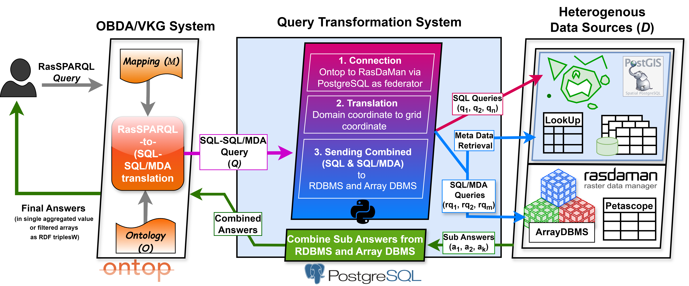
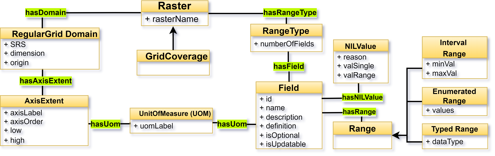

# OntoRaster
Raster Extension of Ontop, a Virtual Knowledge Graph (VKG) system to query over **multidimensional gridded data** or **raster data** or **coverage** combined with **relational data** including geometrical **vector data** of the geospatial domain.

We are also working on our methodology which will enable **OntoRaster** to query over generic **raster data** and **vector data** of any domain under the VKG paradigm. 

## Table of Contents
1. [Framework](#1-framework)
2. [Demo](#2-demo)
3. [Dataset](#3-dataset-d)
4. [Ontology](#4-ontology-o)
5. [Mapping](#5-mapping-m)
6. [More details](#6-more-details)

## 1. Framework



## 2. Demo

### 2.1 Clone this repository

* On Windows
```sh
git clone https://github.com/aghoshpro/OntoRaster  --config core.autocrlf=input
```

* Otherwise, on MacOS and Linux:
```sh
git clone https://github.com/aghoshpro/OntoRaster
```

### 2.2 Setup Docker
* Go to https://docs.docker.com/desktop/ and install docker on your favourite OS.

### 2.3 Run the demo
* For this demo, we assume that the ports `7777`, `7001-7010, 8080` (used for the RDBMS and Array DBMS) and `8082` (used by Ontop) are free. If you need to use different ports, please edit the file `.env`.

* Open `terminal` or `cmd` and navigate to the `OntoRaster` repository
  
* Run the following:
```sh
docker-compose -f docker-compose.ontoraster.yml up
```

* This command starts and initializes the relational database **PostgreSQL** with the spatial extension **PostGIS**. Once the relational database is ready, the array database **Rasdaman** initiates and imports the raster data.

* This Docker-compose file uses the mapping `vkg/OntoRaster.obda` and ontology `vkg/OntoRaster.owl`.

* Finally, the Ontop SPARQL endpoint becomes available at http://localhost:8082/ 
with a set of example RasSPARQL queries.

* RasSPARQL queries are available at `vkg/OntoRaster.toml`.

### 2.4  Demo Endpoint


## 3. Dataset (***D***)

### 3.1 Relational Data (including Vector Data)
* In this demo we used municipalities of Sweden, Bavaria (Germany), and South Tyrol (Italy) as vector data consists a total of approx. 500 unique regions with different geometries and other attributes downloaded from [GADM data](https://gadm.org/download_country.html).

* Stored in **PostgreSQL** with spatial extension PostGIS.
  
* Ideally any user-specific vector data for any region of interest will work.   

### 3.2 Raster Data 
* Stored in array DBMS [RasDaMan](https://doc.rasdaman.org/index.html) ("Raster Data Manager")
  
* [Sweden Land Temperature](https://lpdaac.usgs.gov/products/mod11a1v061/)
* [South Tyrol Temperature](https://lpdaac.usgs.gov/products/mod11a1v061/)
* [Bavaria Surface Temperature](https://lpdaac.usgs.gov/products/mod11a1v061/)

* Ideally any user-specific vector data for any region of interest will work   


## 4. Ontology (***O***)
* Here we have provided **Raster** ontology that describe meta-level information of generic raster data of any domain such as medical, cosmological, geospatial etc.
* We also provided ontology for geospatial raster data a.k.a **grid coverage** a prominent subclass of generic raster data conforming to [OGC Coverage Implementation Schema (CIS)](https://docs.ogc.org/is/09-146r8/09-146r8.html) standard. 




## 5. Mapping (***M***)

Mappings design is the most crusial user-centric step in generating Virtual Knowledge Graph (VKG).
A mapping consist of three main parts: a mapping id, a source and a target. 

- **Mapping ID** is an arbitary but unique identifier
- **Source** refers to a regular SQL query expressed over a relational database fetching the data from the table using the chosen column name.
- **Target** is RDF triple pattern that uses the answer variables from preceding SQL query as placeholders and described using [Turtle syntax](https://github.com/ontop/ontop/wiki/TurtleSyntax) 

Here we have provided a few example mappings for Raster metadata and vector Regions. 

***M1 `Vector Data` - Region Class***

Region includes municipalities, provinces, country, administrative boundaries or any usecase specific custom geometrical vector data.  

- Target
```sparql
:vector_region/demo/{regionId} a :Region .
```
- Source
```sql
SELECT regionId from sample_regions_of_interest
```

***M2 `Vector Data` - Region Name***

- Target
```sparql
vector_region/demo/{regionId} rdfs:label {regionName}^^xsd:string .
```
- Source
```sql
SELECT regionId, name_2 AS regionName from sample_regions_of_interest
```

***M3 `Vector Data` - Region Geometry (in WKT format)***

- Target
```sparql
:vector_region/demo/{regionId} geo:asWKT {regionWkt}^^geo:wktLiteral .
```
- Source
```sql
SELECT region_id,
             CASE
                 WHEN ST_NumGeometries(geom) = 1 THEN ST_AsText(ST_GeometryN(geom, 1))
                 ELSE ST_AsText(geom)
             END AS regionWkt
FROM sample_regions_of_interest
```

***R1 `Raster Metadata` - Raster Class***
- Target
```sparql
:raster/{rasterId} a :Raster .
```
- Source
```sql
SELECT rasterId FROM sample_lookup
```

***R2 `Raster Metadata` - Raster Name***
- Target
```sparql
:raster/{rasterId} rasdb:hasRasterName {rasterName}^^xsd:string .
```
- Source
```sql
SELECT rasterId FROM sample_lookup
```

## 6. More details

Please visit the official website of Ontop https://ontop-vkg.org for more details on Virtual Knowledge Graphs 
and https://doc.rasdaman.org/index.html for more details on array databases.


