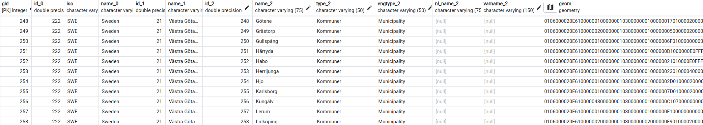
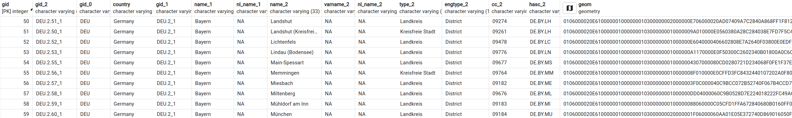
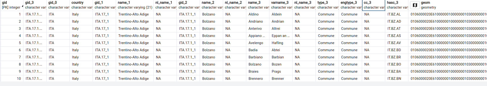

<!-- <picture>
  <source media="(prefers-color-scheme: dark)" srcset="https://github.com/aghoshpro/OntoRaster/assets/71174892/21fee824-3011-4a80-9225-77fc92f3a153">
  <source media="(prefers-color-scheme: light)" srcset="https://github.com/aghoshpro/OntoRaster/assets/71174892/a93cd5f8-cb1b-441b-acaf-415deb089d3b">
  
</picture> -->

<picture>
  <source media="(prefers-color-scheme: dark)" srcset="diagrams/OntoRaster-Dark.png">
  <source media="(prefers-color-scheme: light)" srcset="diagrams/OntoRaster-Light.png">
  
</picture>


<!-- Raster extension of VKG system Ontop to query over **multidimensional raster** data combined with **relational data**. Current version of OntoRaster supports regular gridded 3-D **raster** data and geometrical **vector data** in geospatial domain. We are constantly improving the extension with new features which will enable the end user to query over raster data and vector data of any domain under the VKG paradigm in future. -->

Raster extension of VKG system Ontop to query over **multidimensional raster** data in combination with **relational data**. Currently it handles regular gridded spatial-temporal **raster** data (3D) or OGC coverage data and **vector** data (relational data with geometrical features). We're constantly working on making the extension even better with new features that will allow the end users to query raster and vector data from any domain under the VKG paradigm in the future.

## Table of Contents
1. [Framework](#1-framework)
2. [Demo](#2-demo)
3. [Queries](#3-queries-q)
4. [Ontology](#4-ontology-o)
5. [Dataset](#5-dataset-d)
6. [Mapping](#6-mapping-m)
7. [More details](#7-more-details) 

## 1. Framework


## 2. Demo

### 2.1 Clone this repository

* On Windows
```sh
git clone https://github.com/aghoshpro/OntoRaster  --config core.autocrlf=input
```

* Otherwise, on MacOS and Linux:
```sh
git clone https://github.com/aghoshpro/OntoRaster
```

### 2.2 Setup Docker
* Go to https://docs.docker.com/desktop/ and install docker on your favourite OS.

### 2.3 Run the demo
* For this demo, we assume that the ports `7777`, `7001-7010` (used for the RDBMS),`8080` (for Array DBMS), `8082` (used by Ontop), `6060` (prompt success msg and endpoint) are free. If you need to use different ports, please edit the file `.env`.

* Open `terminal` or `cmd` and navigate to the `OntoRaster` repository
  
* Run the following:
```sh
docker-compose -f docker-compose.ontoraster.yml up
```

* This command starts and initializes the relational database **PostgreSQL** with the spatial extension **PostGIS**. Once the relational database is ready, the array database **Rasdaman** initiates and imports the raster data.

* `NOTE:` When running Rasdaman in a Docker container, it's important to ensure that your system has sufficient resources (CPU, memory, and disk space) to handle large raster file imports. If you encounter issues, such as failed imports, it may be due to insufficient available memory or other resource constraints. If this issue occurs try closing unnecessary applications or increase docker resource limits.

* This Docker-compose file uses the mapping `vkg/OntoRaster.obda` and ontology `vkg/OntoRaster.owl`.

### 2.4  Ontop SPARQL Endpoint
Finally, the Ontop SPARQL endpoint becomes available at http://localhost:8082/ after successful execution of `docker-compose` (ETC 5 min). End users can try out the RasSPARQL queries as shown below,


## 3. Queries (***Q***)
All RasSPARQL queries described below are also available at `vkg/OntoRaster.toml`.

| ***Q<sub>i</sub>***| Description|
| ------------- | ------------- |
| ***Q1*** | What is the dimension of the input raster dataset?  |
| ***Q2*** | Perform element-wise operation over cells of an array of an input raster dataset at a particular timestamp with the user-specific operator and operator.  |
| ***Q3*** | Find spatial average value from the raster dataset over a user-specific vector region at a specific timestamp|
| ***Q4*** | Find spatial maximum value from the raster dataset over a user-specific vector region at a specific timestamp|
| ***Q5*** | Find spatial minimum value from the raster dataset over a user-specific vector region at a specific timestamp|
| ***Q6*** | Find the temporal average value from a user-specific raster dataset over a user-specific vector region between start time and end time.|
| ***Q7*** | Find the temporal maximum value from a user-specific raster dataset over a user-specific vector region between start time and end time.|
| ***Q8*** |Find the temporal minimum value from a user-specific raster dataset over a user-specific vector region between start time and end time.|
| ***Q9*** | Clip a portion of user-specific raster data using the geometry of a user-specific vector region at a particular time and return the clipped array|
| ***Q10***| Clip a portion of user-specific raster data based on the shape of custom vector region at a particular time and return filtered arrays|

## 4. Ontology (***O***)
* Here we have provided **Raster Ontology** ontology that describe meta-level information of $n$-dimensional generic raster data or coverage based on the [OGC Coverage Implementation Schema (CIS)](https://docs.ogc.org/is/09-146r8/09-146r8.html). As of now it only describes only regular gridded coverage or geospatial raster data. The *RegularGridDomain* and *RangeType* classes capture all the information about the domains and ranges of a grid coverage. 


## 5. Dataset (***D***)

### 5.1 Relational Data (including Vector Data)
* This demo utilised municipalities in Sweden, Bavaria (Germany), and South Tyrol (Italy) as ***Regions*** or regions of interest (ROI). The vector data comprises approx 500 distinct regions with varying geometry features with other attributes, taken from [Global Administrative Areas (GADM)](https://gadm.org/download_country.html) database.

*  Stored among three separate tables such as `region_sweden`, `region_bavaria`, `region_south_tyrol` in **VectorTablesDB** database inside **PostgreSQL** with spatial extension **PostGIS**. Snapshot of every table is displayed below,

* `region_sweden` 

* `region_bavaria` 

* `region_south_tyrol` 

  
* Ideally any user-specific vector data for any region of interest will work by adding relevant mappings.   

### 5.2 Raster Data (***D<sup>arr</sup>***)
* Stored in array DBMS [**RasDaMan**](https://doc.rasdaman.org/index.html) ("Raster Data Manager").
* Information about the Raster data can be found at NASA's [Earth Science Data Systems (ESDS)](https://lpdaac.usgs.gov/products/mod11a1v061/)
  * Demo data used for Sweden, Bavaria and South Tyrol can be downloaded direclty from [Google Drive](https://drive.google.com/drive/folders/1yCSmmok3Iz7J2lZ-uleCg_q87GZsHfI7?usp=sharing)


* Metadata are stored in `raster_lookup` table as shown below.
* `raster_lookup` 

* Ideally any 3-D gridded raster data of geospatial domain should work with the addition of relevant mappings.


## 6. Mapping (***M***)

Mappings design is the most crusial user-centric step in generating Virtual Knowledge Graph (VKG).
A mapping consist of three main parts: a mapping id, a source and a target. 

- **Mapping ID** is an arbitary but unique identifier
- **Source** refers to a regular SQL query expressed over a relational database fetching the data from the table using the chosen column name.
- **Target** is RDF triple pattern that uses the answer variables from preceding SQL query as placeholders and described using [Turtle syntax](https://github.com/ontop/ontop/wiki/TurtleSyntax) 

Here we have provided the actual mappings for the demo vector and raster dataset (D). 

For vector data we simply substituted the table name `sample_regions_of_interest` with actual table names kept in RDBMS including `region_sweden`, `region_bavaria`, `region_south_tyrol` displaying vector data (**500+ unique regions**) for municipalities of Sweden, Bavaria (Germany) and South Tyrol (Italy) respectively.

**User can add their own vector data by writing their own mappings in similar fashion shown below.**

### ***M1 `Vector Data` - Region Class***

The ***Region*** class includes any usecase-specific ***regions of interest (ROI)***, such as municipalities, provinces, countries, administrative boundaries, and so on, together with their geometries and other features. 

- Target
  ```sparql
  :region/sweden/{gid} a :Region .
  ```
- Source
  ```sql
  SELECT gid AS regionId FROM region_sweden
  ```

### ***M2 `Vector Data` - Region Name***

- Target
  ```sparql
  :region/demo/{regionId} rdfs:label {regionName}^^xsd:string .
  ```
- Source
  ```sql
  SELECT gid AS regionId, name_2 AS region_name FROM region_sweden
  ```

### ***M3 `Vector Data` - Region Geometry***

- **Target**
  ```sparql
  :region/demo/{regionId} geo:asWKT {regionWkt}^^geo:wktLiteral .
  ```
- **Source**
  ```sql
  SELECT regionId,
              CASE
                  WHEN ST_NumGeometries(geom) = 1 THEN ST_AsText(ST_GeometryN(geom, 1))
                  ELSE ST_AsText(geom)
              END AS regionWkt
  FROM region_sweden
  ```

### ***R1 `Raster Metadata` - Raster Class***
- **Target**
  ```sparql
  :raster/{rasterId} a :Raster .
  ```
- **Source**
  ```sql
  SELECT raster_id AS rasterId FROM raster_lookup
  ```

### ***R2 `Raster Metadata` - Raster Name***
- **Target**
  ```sparql
  :raster/{rasterId} rasdb:rasterName {rasterName}^^xsd:string .
  ```
- **Source**
  ```sql
  SELECT raster_id AS rasterId, raster_name AS rasterName FROM raster_lookup
  ```

## 7. More details

Please visit the official website of Ontop https://ontop-vkg.org for more details on Virtual Knowledge Graphs and https://doc.rasdaman.org/index.html for more details on array databases.


