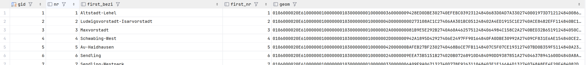

<picture>
  <source media="(prefers-color-scheme: dark)" srcset="diagrams/OntoRaster-Dark.png">
  <source media="(prefers-color-scheme: light)" srcset="diagrams/OntoRaster-Light.png">
  
</picture>

<!-- Raster extension of VKG system Ontop to query over **multidimensional raster** data combined with **relational data**. Current version of OntoRaster supports regular gridded 3-D **raster** data and geometrical **vector data** in geospatial domain. We are constantly improving the extension with new features which will enable the end user to query over raster data and vector data of any domain under the VKG paradigm in future. -->

Demonstrating  **raster** extension of _Virtual Knowledge Graph (VKG)_ system **Ontop** to query over **multidimensional raster** data integrated with **relational data** in arbitrary domains. At present, it integrates and queries regular gridded (geo) spatial-temporal **raster** data together with relational data including **vector** geometrical data on the fly. We're constantly enhancing the extension with new robust features to enable end users to semantically query raster data of arbitrary domain under the VKG paradigm.

## Features

- 🧠 On-the-fly integration of heterogenous tabular data, 2D & 3D geometrical data and $n-dimensional$ data in geospatial (or any arbitrary domain) with automatic meta data handling during query time.
- 🎯 Supports **RasSPARQL**, an extended SPARQL with GeoSPARQL and novel raster functions.
- 🧮 Incremental addition of new OWL ontologies, geo databases with respective mappings.
- 🗜️ Supported Data Formats : `.txt`, `.shp`, `.geojson`, `.geotiff`, `.netcdf`, `.gml`, `json`.
- 🤖 Query Answers are explainable by LLMs i.e., Ollama, ChatGPT, Claude etc.
- 🖥️ Clean Web UI and SPARQL YASGUI for usage demonstration.

## Table of Contents

0. [Motivation](#0-motivation)
1. [Framework](#1-framework)
2. [Demo](#2-demo)
3. [Queries](#3-queries-q)
4. [Ontology (**_O_**)](#4-ontology-o)

- 4.1. [Raster Ontology](#41-raster-ontology)
- 4.2. [GeoSPARQL v1.1](#42-geosparql-v11)
- 4.3. [GeoNames v3.3](#43-geonames-v33)
- 4.4. [LinkedGeoData](#44-linkedgeodata)
- 4.5. [CityGML v2.0](#45-citygml-v20)
- 4.6. [Quantities, Units, Dimensions and Types (QUDT) Ontology](#46-quantities-units-dimensions-and-types-qudt)

5. [Heterogenous Data Sources (**_D_**)](#5-heterogenous-data-sources-d)

- 5.1. [Relational Data](#51-relational-data)
  - 5.1.1. [GeoNames Data](#511-geonames-data)
  - 5.1.2. [Vector Data (**_D<sup>Vector</sup>_**)](#512-vector-data)
  - 5.1.3. [3DCityGML Data (**_D<sup>City3D</sup>_**)](#513-citygml-data-dcity3d)
  - 5.1.4. [OSM Data (**_D<sup>OSM</sup>_**)](#51-osm-data-dosm)

- 5.2. [Raster Data (**_D<sup>arr</sup>_**)](#52-raster-data-darr)

6. [Mappings (**_M_**)](#6-mapping-m)
7. [More details](#7-more-details)

## 0. Motivation

- **Query** - _List all the 30 meters tall residentials in **Munich** where average terrain elevation less than **550 meters** and average land surface temperature is over **300K**, given the following heterogenous data_.

  

  How can someone find an answer to this question if they don't have the required domain knowledge or expertise regarding to handle these many types of spatial data and their respective metadata.

  😃 **You need **OntoRaster** to solve this.** 😃

## 1. Framework


<!-- ### 1.1. For more check out the publication

> **Ghosh, A**., Pano, A., Xiao, G., Calvanese, D. [**OntoRaster: Extending VKGs with Raster Data**](https://doi.org/10.1007/978-3-031-72407-7_9). _International Joint Conference on Rules and Reasoning. RuleML+RR 2024. Lecture Notes in Computer Science (LNCS), vol 15183. Springer_, **2024**. -->

## 2. Demo

### 2.1 Clone this repository

- ```sh
  git clone https://github.com/aghoshpro/OntoRaster.git
  ```

### 2.2 Setup Docker

- Go to <https://docs.docker.com/desktop/> and install docker on your favourite OS.

### 2.3 Run The Demo

- For this demo, we assume that the ports `7777`, `7001-7010` (used for the RDBMS),`8080` (for Array DBMS), `8082` (used by Ontop), `6060` (prompt success msg and endpoint) are free. If you need to use different ports, please edit the file `.env`.

- Open `terminal` or `cmd` and navigate to the `OntoRaster` repository
- Run the following:

  ```sh
  docker-compose -f docker-compose.ontoraster.yml up
  ```

- This command starts and initializes the relational database **PostgreSQL** with the spatial extension **PostGIS**. Once the relational database is ready, the array database **Rasdaman** initiates and imports the raster data.

- `NOTE:` When running Rasdaman in a Docker container, it's important to ensure that your system has sufficient resources (CPU, memory, and disk space) to handle large raster file imports. If you encounter issues, such as failed imports, it may be due to insufficient available memory or other resource constraints. If this issue occurs try closing unnecessary applications or increase docker resource limits.

- `docker-compose` file uses the mapping `vkg/OntoRaster.obda` and ontology `vkg/OntoRaster.owl`.

### 2.4 Ontop SPARQL Endpoint

It becomes available at <http://localhost:8082/> under `success` in docker desktop (ETC 5 min). Click the link and try out the RasSPARQL queries as shown below,


#### 2.4.1 RasSPARQL Query Yasgui Editor 

<!--  -->


### 2.5 Stop Demo (optional)

- Press `Ctrl+C` to stop and then run the following,

  ```sh
  docker-compose -f docker-compose.ontoraster.yml down --volumes --rmi all 
  ```

## 3. Queries (**_Q_**)

All RasSPARQL queries are mentioned at [`vkg/OntoRaster.toml`](https://github.com/aghoshpro/OntoRaster/blob/main/vkg/OntoRaster.toml).

| **_Q<sub>i</sub>_** | Functional Description                                                                                                                                   |
| ------------------- | -------------------------------------------------------------------------------------------------------------------------------------------------------- |
| **_Q1_**            | What is the dimension of the input raster dataset?                                                                                                       |
| **_Q2_**            | Perform element-wise operation over cells of an array of an input raster dataset at a particular timestamp with the user-specific operator and operator. |
| **_Q3_**            | Find spatial average value from the raster dataset over a user-specific vector region at a specific timestamp                                            |
| **_Q4_**            | Find spatial maximum value from the raster dataset over a user-specific vector region at a specific timestamp                                            |
| **_Q5_**            | Find spatial minimum value from the raster dataset over a user-specific vector region at a specific timestamp                                            |
| **_Q6_**            | Find the temporal average value from a user-specific raster dataset over a user-specific vector region between start time and end time.                  |
| **_Q7_**            | Find the temporal maximum value from a user-specific raster dataset over a user-specific vector region between start time and end time.                  |
| **_Q8_**            | Find the temporal minimum value from a user-specific raster dataset over a user-specific vector region between start time and end time.                  |
| **_Q9_**            | Clip a portion of user-specific raster data using the geometry of a user-specific vector region at a particular time and return the clipped array        |
| **_Q10_**           | Clip a portion of user-specific raster data based on the shape of custom vector region at a particular time and return filtered arrays                   |

### 3.1 Query Result

- Find all the `residentials` and respective `sub-districts` in Munich, where the average terrain `elevation` is above 520 meters

  

  ```SQL
  SELECT ?distName ?elevation ?distWkt ?distWktColor ?bldgWkt ?bldgWktColor {
  ?region a :SubDistrict . 
  ?region rdfs:label ?distName .
  ?region geo:asWKT ?distWkt .
  BIND('#008AFF5C' AS ?distWktColor)
  ?building a lgdo:Residential .
  ?building geo:asWKT ?bldgWkt .
  BIND('red' AS ?bldgWktColor)
  FILTER (geof:sfWithin(?bldgWkt, ?distWkt))
  ?gridCoverage a :Raster .
  ?gridCoverage rasdb:rasterName ?rasterName .
  FILTER (CONTAINS(?rasterName, 'Elevation'))
  BIND ('2000-02-11T00:00:00+00:00'^^xsd:dateTime AS ?timeStamp)
  BIND (rasdb:rasSpatialAverage(?timeStamp, ?distWkt, ?rasterName) AS ?elevation)
  FILTER(?elevation > 520)
  } 
  ```

- Find all the `rasters` within respective `sub-districts` in Munich based on the similar conditions of above query [****WORK IN PROGRESS**]
  <!--  -->
  

    ```SQL
    SELECT ?distName ?elevation ?distWkt ?distWktColor ?bldgWkt ?bldgWktColor {
    ?region a :SubDistrict . 
    ?region rdfs:label ?distName .
    ?region geo:asWKT ?distWkt .
    ?building a lgdo:Residential .
    ?building geo:asWKT ?bldgWkt .
    FILTER (geof:sfWithin(?bldgWkt, ?distWkt))
    ?gridCoverage a :Raster .
    ?gridCoverage rasdb:rasterName ?rasterName .
    FILTER (CONTAINS(?rasterName, 'Elevation'))
    BIND ('2000-02-11T00:00:00+00:00'^^xsd:dateTime AS ?timeStamp)
    BIND (rasdb:rasGeoTIFF(?timeStamp, ?distWkt, ?rasterName) AS ?elevation)
    FILTER(?elevation > 520)
    } 
    ```

## 4. Ontology (**_O_**)

### 4.1. Raster Ontology

We have provided **Raster Ontology** ontology that describe meta-level information of $n-dimensional$ generic raster data or coverage based on the [OGC Coverage Implementation Schema (CIS)](https://docs.ogc.org/is/09-146r8/09-146r8.html) and the paper [Andrejev et al., 2015](https://www2.it.uu.se/research/group/udbl/publ/DSDIS2015.pdf). As of now it only describes only regular gridded coverage or geospatial raster data. The _RegularGridDomain_ and _RangeType_ classes capture all the information about the domains and ranges of a grid coverage.


### 4.2. GeoSPARQL v1.1

For vector data we are using [GeoSPARQL v1.1 Ontology](https://opengeospatial.github.io/ogc-geosparql/geosparql11/index.html) introduces classes likes features, geometries, and their representation using Geography Markup Language (GML) and Well-Known Text (WKT) literals, and includes topological relationship vocabularies. GeoSPARQL also provides an extension of the standard SPARQL query interface, supporting a set of topological functions for quantitative reasoning.

### 4.3. GeoNames v3.3

The [GeoNames v3.3 Ontology](https://www.geonames.org/ontology/documentation.html), part of [GeoNames](https://www.geonames.org/about.html) geographical database, makes it possible to add geospatial semantic information to the Word Wide Web (WWW). It consists over 11 million geonames toponyms with a distinct URL correlating with RDF web service. Founded by Marc Wick (`marc@geonames.org`), [Unxos GmbH](https://www.unxos.com/), Switzerland.

<!-- - Ontology is available at <https://www.geonames.org/ontology/documentation.html> -->

### 4.4. LinkedGeoData

- Defines classes of objects appearing on Open Street Map (OSM) such as `roads`, `railways`, `amenities`, `emergency infrastructure`, `tourist attractions`, etc. This extensive [ontology](https://github.com/GeoKnow/LinkedGeoData/blob/develop/lgd-ontop-web/lgd.owl), from the [LinkedGeoData Project](http://linkedgeodata.org/) comprises over 400 million geo-elements spread accross 500 classes. The RDF data comprises approximately 20 billion triples. Data is available according to the Linked Data principles and interlinked with DBpedia and GeoNames.

<!-- - Developed by Ontology Engineering Group ([link](https://smartcity.linkeddata.es/ontologies/mapserv.kt.agh.edu.plontologiesosm.owl.html)). -->

- **OSMonto**: An ontology of OpenStreetMap tags was developed to facilitate tag maintenance and overview, as well as to enable the enrichment of tag semantics through relationships with other ontologies ([Mihai et al 2011](https://www.inf.unibz.it/~okutz/resources/osmonto.pdf)). It was presented at State of the Map Europe [SotM-EU'2011](https://stateofthemap.eu/index.html). View the  [.owl](https://raw.githubusercontent.com/doroam/planning-do-roam/master/Ontology/tags.owl) file in [Protégé](https://protegeproject.github.io/protege/getting-started/).

<!-- - [Open Street Map integration](https://documentation.researchspace.org/resource/Help:OpenStreetMap) : This integration creates a simple lookup service to federate against the Open Street Maps (OSM) API, allowing users to reference place names in their ResearchSpace instances. Users can lookup a street address, a city, a country etc. and be able to reference this in their data. -->

### 4.5. CityGML v2.0

Developed by the [Knowledge Engineering @ CUI](https://cui.unige.ch/isi/ke/ontologies) at the University of Geneva. In our research, [CityGML v2.0 Ontology](https://smartcity.linkeddata.es/ontologies/cui.unige.chcitygml2.0.html) is used for for the KG construction based on 3D CityGML buildings data with the further modifications and OSM integration by [Ding et al., 2024](https://doi.org/10.1080/10095020.2024.2337360).

<!-- - Research is undergoing for more efficient integration of 3DCityGML data. -->
- [CityGMl 3.0](https://doi.org/10.1007/s41064-020-00095-z) is in progress to be a standard. Although **CityGML 2.0** remains most popular yet for practical usage and implementation.

### 4.6. Quantities, Units, Dimensions and Types (QUDT)

- The [QUDT](https://qudt.org) provides set of vocabularies representing the base classes properties, and restrictions used for modeling physical quantities, measurement units, and their dimensions in various measurement systems originally developed for the NASA Exploration Initiatives Ontology Models ([NExIOM](https://step.nasa.gov/pde2009/slides/20090506145822/PDE2009-NExIOM-TQ_v2.0-aRH-sFINAL.pdf)) project and now it forms the basis of the [NASA QUDT Handbook](http://ontolog.cim3.net/file/work/OntologyBasedStandards/2013-10-10_Case-for-QUOMOS/NASA-QUDT-Handbook-v10--RalphHodgson_20131010.pdf).
- QUDT aims to improve interoperability of data and the specification of information structures through industry standards for `Units of Measure (UoM)`, quantity types, dimensions and data Types ([Ray et al., 2011](https://doi.org/10.25504/FAIRsharing.d3pqw7)).

## 5. Heterogenous Data Sources (**_D_**)

### Area of Interest (AOI)

- **Munich**, the capital of Bavaria, Germany, covering approximately **334.00** $km^2$ including the city and the surrounding area. This area is densely populated, hence features numerous structures encompassing numerous  residential and commercial zones alongside public amenities, establishing it as a bustling business hub. Also, it aligns with our collaboration with TU Munich under the DFG Project [Dense and Deep Geographic Virtual Knowledge Graphs for Visual Analysis (D2G2)](https://gepris.dfg.de/gepris/projekt/500249124).

- \***\*NOTE** - Any other or user-specific AOI with similar kinds of data can be used by adding relevant mappings assertions.

### 5.1 Relational Data


### 5.1.1. GeoNames Data

Contains over **12 million** unique geographical features with their 25 million names including alternate and translated names (16 million), population, timezone, geo coordinates (lat/long in WGS84) etc., collected from various **[data sources](https://www.geonames.org/datasources/)**. All features are categorized into one of **9 feature classes** e.g., **A, H, L, P, R, S, T, U, V**  and further subcategories into one of **[645 feature codes](https://www.geonames.org/export/codes.html)**. Data available for each country at **[here](https://www.geonames.org/export/)**.

|Feature classes |Feature codes|
|----------------|------------------------|
| **A** (country, state, region,...) | `A.ADM1` - Admin Region 1,`A.ADM2` - Admin Region 2, `TERR` - Territory, `ZN` - Zone|
| **H** (stream, lake, ...)          | `H.ANCH` - Anchorage. `H.FISH` - Fishing Area, `H.LKS` - Lakes|
| **L** (parks,area, ...)            | `L.RGN`- Region, `L.CONT` - Continent, `L.AREA` - Area|
| **P** (city, village,...)          | `P.PPL` - Populated place, `P.PPLC` -  Capital of a political entity |
| **R** (road, railroad)             | `R.ST` - Street, `R.RD` -Road, `R.RR` - Railroad|
| **S** (spot, building, farm)       | `S.UNIV`- University, `S.SCH`- School, `S.RSTN` - Railroad Station, `S.AIRP` -Airport|
| **T** (mountain,hill,rock,...)     | `T.DSRT`- Desert, `T.MT` - Mountain, `T.PEN` - Peninsula|
| **U** (undersea)                   | `U.BDLU` - Borderland, `U.MTU` - Mountain|
| **V** (forest,heath,...)           | `V.FRST`- Forests, `V.GRSLD` - Grassland|

### 5.1.2. Vector Data

- This demo utilized 25 districts, 105 subdistricts, OpenStreetMap (OSM) data and 3DCityGML 3D buildings data as vector data for Munich as shown above in **Figure (a)-(d)**.

<!-- , downloaded from [arcgis](https://www.arcgis.com/home/item.html?id=369c18dfc10d457d9d1afb28adcc537b). -->

- Stored in two separate tables such as `munich_dist25`, `munich_dist105` in **VectorTablesDB** database inside **PostgreSQL** with spatial extension **PostGIS**. Snapshots are displayed below,

- `munich_dist25` 

- `munich_dist105` 

- This demo also posses municipalities of Sweden, Bavaria (Germany), and South Tyrol (Italy) as **Area of Interests (AOIs)** which comprises approx **500** distinct regions with varying geometry features i.e., enclaves, islands with other attributes. For instance, the table for Sweden is as follows,

  - `region_sweden` 

  - Same goes for `region_bavaria` and `region_south_tyrol`. Check this branch [`ontoraster/PaperRuleML'24`](https://github.com/aghoshpro/OntoRaster/tree/ontoraster/Paper%40RuleML'24) for more info.

---

### 5.1.3. CityGML Data (**_D<sup>City3D</sup>_**)

#### 5.1.3.1. Installing 3DCityDB

- Check Java version 11 or higher

- Follow the [instructions](https://3dcitydb-docs.readthedocs.io/en/latest/first-steps/install-impexp.html) to install **3DCityDB** schema that will contain **CityGML** data in RDBMS

- Go to [3DCityDB](https://www.3dcitydb.org/3dcitydb/downloads/) and download the [Importer/Exporter](https://3dcitydb-docs.readthedocs.io/en/latest/first-steps/setup-3dcitydb.html#installation-steps-on-postgresql) installer `.jar` file

- Set up **3DCityDB** schema for PostgreSQL as per the instructions [here](https://3dcitydb-docs.readthedocs.io/en/latest/first-steps/setup-3dcitydb.html#installation-steps-on-postgresql)

- Launching Importer/Exporter [link](https://3dcitydb-docs.readthedocs.io/en/latest/impexp/launching.html#launching-the-importer-exporter)

- Start the 3DCityDB GUI Wizard

  > $ chmod u+x 3DCityDB-Importer-Exporter && ./3DCityDB-Importer-Exporter

#### 5.1.3.2. Get Data

- **GUI** - First check how many LOD2 gml files are needed to cover the aforementioned **AOI**

  - Go to [OpenData](https://geodaten.bayern.de/opengeodata/OpenDataDetail.html?pn=lod2&active=MASSENDOWNLOAD) and upload text from `./citygml_data/Munich_EWKT.txt` containing geometry of the AOI in `EWKT` format.

  - It will result a file `./citygml_data/lod2.meta4` which contains all `.gml` files with respective links.

  - Two ways to go using GUI are displayed below.

    <div align="center">
      
    </div>

- **CLI** - For the demo we used `./citygml_data/get.munich_citygml.sh` script (see below) which can be run in `terminal` (linux) or `gitbash` (Windows) to download all **110** `.gml` files (~ **6.4 GB**). .

    ```sh
    #!/bin/bash
    for LONG in `seq 674 2 702`
    do
      for LAT in `seq 5328 2 5346`
      do
        wget "https://download1.bayernwolke.de/a/lod2/citygml/${LONG}_${LAT}.gml"
      done
    done
    ```

#### 5.1.3.3. Visualise CityGML Data as CityJSON

- [CityJSON](https://www.cityjson.org) is a JSON-based encoding for storing 3D city models.
- CityGML 2 CityJSON Conversion [here](https://www.cityjson.org/tutorials/conversion/)
- Drop the converted `.json` file in the CityJSON official online viewer called [ninja](https://www.cityjson.org/tutorials/getting-started/#visualise-it).

#### 5.1.2.4. Manipulate CityJSON files using CityJSON/io (cjio)

- [clio](https://www.cityjson.org/tutorials/getting-started/#manipulate-and-edit-it-with-cjio) is a command-line interface program used to edit, marge and validate CityJSON files.

- Python (version >3.7) is required and using pip `pip install cjio`.

---

### 5.1.4. OSM Data (**_D<sup>osm</sup>_**)

#### Download Data

- [GeoFabrik OpenStreetMap Data Extracts](https://download.geofabrik.de) : Select your area of interest (AOI) and download OSM data in various formats such as `.osm`, `.pfb`, `.shp`.

- You can also use CLI tools such as `wget` pr `curl` if you have the Bounding Box (BBOX) of AOI
  - **BBOX** : [11.3608770000001300,48.0615539900001068,11.7230828880000786,48.2481460580001453]
  - _left,bottom,right,top_
  - _minLongitude , minLatitude , maxLongitude , maxLatitude_
  - _west,south,east,north_
  - _xmin,ymin,xmax,ymax_
  - OSM [Docs](https://wiki.openstreetmap.org/wiki/Bounding_box)

- Check [bboxfinder.com](http://bboxfinder.com/#0.000000,0.000000,0.000000,0.000000) to find BBOX for your AOI

#### Small AOI

-

  ```sh
  wget -O Munich.osm "https://api.openstreetmap.org/api/0.6/map?bbox=11.2871,48.2697,11.9748,47.9816"
  ```

#### LARGER AOI (>300 MB)

-

  ```sh
  wget -O Munich.osm "http://overpass.openstreetmap.ru/cgi/xapi_meta?*[bbox=11.3608770000001300,48.0615539900001068,11.7230828880000786,48.2481460580001453]"
  ```

---

### 5.2 Raster Data (**_D<sup>arr</sup>_**)


- **Figure (e)-(i)** displays the respective raster data over Munich which includes elevation, land surface temperature, vegetation, snow cover and soil moisture from different satellite sensors.

- Stored in array DBMS [**RasDaMan**](https://doc.rasdaman.org/index.html) ("Raster Data Manager").

<!-- - Information about the Raster data can be found at NASA's [Earth Science Data Systems (ESDS)](https://lpdaac.usgs.gov/products/mod11a1v061/)

  - Demo data used for Sweden, Bavaria and South Tyrol can be downloaded direclty from [Google Drive](https://drive.google.com/drive/folders/1yCSmmok3Iz7J2lZ-uleCg_q87GZsHfI7?usp=sharing) -->

- Metadata of rasters are stored in `raster_lookup` table as shown below.
- `raster_lookup` 

- Ideally any 3-D gridded raster data of geospatial domain should work with the addition of relevant mappings.

## 6. Mapping (**_M_**)

Mappings design is the most crucial user-centric step in generating Virtual Knowledge Graph (VKG) as it connects the raw data with respective domain ontology to generate knowledge graph during user query.

- A mapping consist of three main parts: a mapping id, a source and a target.

  - **Mapping ID** is an arbitary but unique identifier
  - **Source** refers to a regular SQL query expressed over a relational database fetching the data from the table using the chosen column name.
  - **Target** is RDF triple pattern that uses the answer variables from preceding SQL query as placeholders and described using [Turtle syntax](https://github.com/ontop/ontop/wiki/TurtleSyntax)

#### Check out the mappings at [`vkg/OntoRaster.obda`](https://github.com/aghoshpro/OntoRaster/blob/main/vkg/OntoRaster.obda)
<!-- 
### 6.1. **Relational Data (including `Vector`)**

**Area of Interest (AOI)** contains one or more regions. **_Region_** can be a super-class that includes any type of real world ***feature classes*** such as administrative boundaries  e,g., `municipalities`, `districts`, `sub-districts`,`provinces`,`countries` or any user specific `custom region`. Here we have only provided the mapping for 25 districts of Munich (`munich_dist25` table).

#### **_M1 - `regionId`_ of District Class**
- Target

  ```sparql
  :vector_region/bavaria/munich/districts/{regionId} a :District .
  ```

- Source

  ```sql
  SELECT gid AS regionId FROM public.munich_dist25
  ```

#### **_M2 - `regionName`_ of District Class**

- Target

  ```sparql
  :vector_region/bavaria/munich/districts/{regionId} rdfs:label {regionName}^^xsd:string .
  ```

- Source

  ```sql
  SELECT gid AS regionId, first_bezi AS regionName FROM public.munich_dist25
  ```
#### **_M3 - `regionGeometry`_ of District Class**

- **Target**

  ```sparql
  :vector_region/bavaria/munich/districts/{regionId} geo:asWKT {regionWkt}^^geo:wktLiteral .
  ```

- **Source**

  ```sql
  SELECT SELECT gid AS regionId,,
              CASE
                  WHEN ST_NumGeometries(geom) = 1 THEN ST_AsText(ST_GeometryN(geom, 1))
                  ELSE ST_AsText(geom)
              END AS regionWkt
  FROM public.munich_dist25
  ```

- Please check `vkg/OntoRaster.obda` for rest of the mappings for `subdistricts`, `osm_buildings` and `3dcitygml` buildings.

### 6.2. **Raster Metadata**

#### **_M11 - `rasterId`_ of Raster Class**

- **Target**

  ```sparql
  :raster/{rasterId} a :Raster .
  ```

- **Source**

  ```sql
  SELECT raster_id AS rasterId FROM raster_lookup
  ```

#### **_M12 - `rasterName`_ of Raster Class**

- **Target**

  ```sparql
  :raster/{rasterId} rasdb:rasterName {rasterName}^^xsd:string .
  ```

- **Source**

  ```sql
  SELECT raster_id AS rasterId, raster_name AS rasterName FROM raster_lookup
  ``` -->

## 7. More details

Please visit the official website of Ontop <https://ontop-vkg.org> for more details on Virtual Knowledge Graphs and <https://doc.rasdaman.org/index.html> for more details on array databases.
