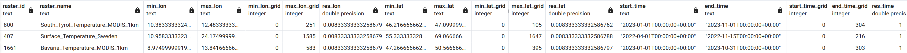

<!-- <picture>
  <source media="(prefers-color-scheme: dark)" srcset="https://github.com/aghoshpro/OntoRaster/assets/71174892/21fee824-3011-4a80-9225-77fc92f3a153">
  <source media="(prefers-color-scheme: light)" srcset="https://github.com/aghoshpro/OntoRaster/assets/71174892/a93cd5f8-cb1b-441b-acaf-415deb089d3b">
  
</picture> -->

<picture>
  <source media="(prefers-color-scheme: dark)" srcset="diagrams/OntoRaster-Dark.png">
  <source media="(prefers-color-scheme: light)" srcset="diagrams/OntoRaster-Light.png">
  
</picture>

<!-- Raster extension of VKG system Ontop to query over **multidimensional raster** data combined with **relational data**. Current version of OntoRaster supports regular gridded 3-D **raster** data and geometrical **vector data** in geospatial domain. We are constantly improving the extension with new features which will enable the end user to query over raster data and vector data of any domain under the VKG paradigm in future. -->

Raster extension of VKG system Ontop to query over **multidimensional raster** data in combination with **relational data**. Currently it handles regular gridded spatial-temporal **raster** data (3D) or OGC coverage data and **vector** data (relational data with geometrical features). We're constantly working on making the extension even better with new features that will allow the end users to query raster and vector data from any domain under the VKG paradigm in the future.

## Table of Contents

1. [Framework](#1-framework)
2. [Demo](#2-demo)
3. [Queries](#3-queries-q)
4. [Ontology](#4-ontology-o)
5. [Dataset](#5-dataset-d)
6. [Mapping](#6-mapping-m)
7. [More details](#7-more-details)

## 1. Framework


### 1.1. For more check out the publication

> **Ghosh, A**., Pano, A., Xiao, G., Calvanese, D. [**OntoRaster: Extending VKGs with Raster Data**](https://doi.org/10.1007/978-3-031-72407-7_9). _International Joint Conference on Rules and Reasoning. RuleML+RR 2024. Lecture Notes in Computer Science (LNCS), vol 15183. Springer_, **2024**.

## 2. Demo

### 2.1 Clone this repository

- On Windows

```sh
git clone https://github.com/aghoshpro/OntoRaster  --config core.autocrlf=input
```

- Otherwise, on MacOS and Linux:

```sh
git clone https://github.com/aghoshpro/OntoRaster
```

### 2.2 Setup Docker

- Go to https://docs.docker.com/desktop/ and install docker on your favourite OS.

### 2.3 Run the demo

- For this demo, we assume that the ports `7777`, `7001-7010` (used for the RDBMS),`8080` (for Array DBMS), `8082` (used by Ontop), `6060` (prompt success msg and endpoint) are free. If you need to use different ports, please edit the file `.env`.

- Open `terminal` or `cmd` and navigate to the `OntoRaster` repository
- Run the following:

```sh
docker-compose -f docker-compose.ontoraster.yml up
```

- This command starts and initializes the relational database **PostgreSQL** with the spatial extension **PostGIS**. Once the relational database is ready, the array database **Rasdaman** initiates and imports the raster data.

- `NOTE:` When running Rasdaman in a Docker container, it's important to ensure that your system has sufficient resources (CPU, memory, and disk space) to handle large raster file imports. If you encounter issues, such as failed imports, it may be due to insufficient available memory or other resource constraints. If this issue occurs try closing unnecessary applications or increase docker resource limits.

- This Docker-compose file uses the mapping `vkg/OntoRaster.obda` and ontology `vkg/OntoRaster.owl`.

### 2.4 Ontop SPARQL Endpoint

Finally, the Ontop SPARQL endpoint becomes available at http://localhost:8082/ after successful execution of `docker-compose` (ETC 5 min). End users can try out the RasSPARQL queries as shown below,


## 3. Queries (**_Q_**)

All RasSPARQL queries described below are also available at `vkg/OntoRaster.toml`.

| **_Q<sub>i</sub>_** | Description                                                                                                                                              |
| ------------------- | -------------------------------------------------------------------------------------------------------------------------------------------------------- |
| **_Q1_**            | What is the dimension of the input raster dataset?                                                                                                       |
| **_Q2_**            | Perform element-wise operation over cells of an array of an input raster dataset at a particular timestamp with the user-specific operator and operator. |
| **_Q3_**            | Find spatial average value from the raster dataset over a user-specific vector region at a specific timestamp                                            |
| **_Q4_**            | Find spatial maximum value from the raster dataset over a user-specific vector region at a specific timestamp                                            |
| **_Q5_**            | Find spatial minimum value from the raster dataset over a user-specific vector region at a specific timestamp                                            |
| **_Q6_**            | Find the temporal average value from a user-specific raster dataset over a user-specific vector region between start time and end time.                  |
| **_Q7_**            | Find the temporal maximum value from a user-specific raster dataset over a user-specific vector region between start time and end time.                  |
| **_Q8_**            | Find the temporal minimum value from a user-specific raster dataset over a user-specific vector region between start time and end time.                  |
| **_Q9_**            | Clip a portion of user-specific raster data using the geometry of a user-specific vector region at a particular time and return the clipped array        |
| **_Q10_**           | Clip a portion of user-specific raster data based on the shape of custom vector region at a particular time and return filtered arrays                   |

## 4. Ontology (**_O_**)

### 4.1. GeoSPARQL v1.1 Ontology   

For vector data we are using [GeoSPARQL v1.1 Ontology](https://opengeospatial.github.io/ogc-geosparql/geosparql11/index.html) introduces classes likes features, geometries, and their representation using Geography Markup Language (GML) and Well-Known Text (WKT) literals, and includes topological relationship vocabularies. GeoSPARQL also provides an extension of the standard SPARQL query interface, supporting a set of topological functions for quantitative reasoning.

### 4.2. Raster Ontology 

- Here we have provided **Raster Ontology** ontology that describe meta-level information of $n$-dimensional generic raster data or coverage based on the [OGC Coverage Implementation Schema (CIS)](https://docs.ogc.org/is/09-146r8/09-146r8.html) and the paper [Andrejev et al.](https://www2.it.uu.se/research/group/udbl/publ/DSDIS2015.pdf). As of now it only describes only regular gridded coverage or geospatial raster data. The _RegularGridDomain_ and _RangeType_ classes capture all the information about the domains and ranges of a grid coverage.


### 4.3. CityGML v2.0 Ontology 

- We are also using [CityGML v2.0 Ontology](https://cui.unige.ch/isi/ke/ontologies) developed by the University of Geneva for the ontology component of the KG construction phase and further modified by [L. Ding et al](https://doi.org/10.1080/10095020.2024.2337360) by adding further classes on addresses (including xAL) and removing object properties with the same IRI as data properties.


## 5. Dataset (**_D_**)

### 5.1 Relational Data

#### 5.1.1. Vector Data

- This demo utilised municipalities in Sweden, Bavaria (Germany), and South Tyrol (Italy) as **_Regions_** or regions of interest (ROI). The vector data comprises approx 500 distinct regions with varying geometry features with other attributes, taken from [Global Administrative Areas (GADM)](https://gadm.org/download_country.html) database.

- Stored among three separate tables such as `region_sweden`, `region_bavaria`, `region_south_tyrol` in **VectorTablesDB** database inside **PostgreSQL** with spatial extension **PostGIS**. Snapshot of every table is displayed below,

- `region_sweden` 

- `region_bavaria` 

- `region_south_tyrol` 
- Ideally any user-specific vector data for any region of interest will work by adding relevant mappings.

### 5.1.2. CityGML Data (**_D<sup>City3D</sup>_**)

#### Installing 3DCityDB

- Check Java version 11 or higher

- Follow the [instructions](https://3dcitydb-docs.readthedocs.io/en/latest/first-steps/install-impexp.html) to install **3DCityDB** schema that will contain **CityGML** data in RDBMS

- Go to [3DCityDB](https://www.3dcitydb.org/3dcitydb/downloads/) and download the [Importer/Exporter](https://3dcitydb-docs.readthedocs.io/en/latest/first-steps/setup-3dcitydb.html#installation-steps-on-postgresql) installer `.jar` file

- Set up **3DCityDB** schema for PostgreSQL as per the instructions [here](https://3dcitydb-docs.readthedocs.io/en/latest/first-steps/setup-3dcitydb.html#installation-steps-on-postgresql)

- Launching Importer/Exporter [link](https://3dcitydb-docs.readthedocs.io/en/latest/impexp/launching.html#launching-the-importer-exporter)

- Start the #DCityDB GUI Wizard

  > $ chmod u+x 3DCityDB-Importer-Exporter && ./3DCityDB-Importer-Exporter

#### Get Data

 - Area of Interest : **Munich Metropolitan Area** 

 - To check how many LOD2 gml files are needed to cover the aforementioned AOI one may go to [OpenData](https://geodaten.bayern.de/opengeodata/OpenDataDetail.html?pn=lod2&active=MASSENDOWNLOAD) and upload text file containing geometry of the AOI in `EWKT` format.

 - It will give something like below. One can also download the file `./diagrams/lod2.meta4` which contains all LONGs and LATs for the entire dataset with respective links.

 <div align="center">
   
 </div>
 
 - Run the following shell script (or gitbash in Windows) to download files (**110** `.gml` files ~ **6.4 GB** in our study)

    ```sh
    #!/bin/bash

    for LONG in `seq 674 2 680`
    do
      for LAT in `seq 5332 2 5342`
      do
        wget "https://download1.bayernwolke.de/a/lod2/citygml/${LONG}_${LAT}.gml"
      done
    done
    ```

#### Visualise CityGML Data as CityJSON
- [CityJSON](https://www.cityjson.org) is a JSON-based encoding for storing 3D city models.
- CityGML 2 CityJSON Conversion [here](https://www.cityjson.org/tutorials/conversion/)
- Drop the converted `.json` file in the CityJSON official online viewer called [ninja](https://www.cityjson.org/tutorials/getting-started/#visualise-it).


#### Manipulate CityJSON files using CityJSON/io (cjio)
- [clio](https://www.cityjson.org/tutorials/getting-started/#manipulate-and-edit-it-with-cjio) is a command-line interface program used  to edit, marge and validate CityJSON files.

- Python (version >3.7) is required and using pip `pip install cjio`.

### 5.1.3. OSM Data (**_D<sup>osm</sup>_**)

#### Direct Download

- [GeoFabrik OpenStreetMap Data Extracts](https://download.geofabrik.de) : Select your area of interest (AOI) and download OSM data in various formats such as `.osm`, `.pfb`, `.shp`. 

- You can also use CLI tools such as `wget` pr `curl` if you have the Bounding Box (BBOX) of AOI
  - **BBOX** : [11.3608770000001300,48.0615539900001068,11.7230828880000786,48.2481460580001453]

#### Small AOI
```
$ wget -O Munich.osm "https://api.openstreetmap.org/api/0.6/map?bbox=11.2871,48.2697,11.9748,47.9816"
```


#### LARGER AOI (>300 MB)

```
$ wget -O Munich.osm "http://overpass.openstreetmap.ru/cgi/xapi_meta?*[bbox=11.3608770000001300,48.0615539900001068,11.7230828880000786,48.2481460580001453]"
```

### 5.2 Raster Data (**_D<sup>arr</sup>_**)

- Stored in array DBMS [**RasDaMan**](https://doc.rasdaman.org/index.html) ("Raster Data Manager").
- Information about the Raster data can be found at NASA's [Earth Science Data Systems (ESDS)](https://lpdaac.usgs.gov/products/mod11a1v061/)

  - Demo data used for Sweden, Bavaria and South Tyrol can be downloaded direclty from [Google Drive](https://drive.google.com/drive/folders/1yCSmmok3Iz7J2lZ-uleCg_q87GZsHfI7?usp=sharing)

- Metadata are stored in `raster_lookup` table as shown below.
- `raster_lookup` 

- Ideally any 3-D gridded raster data of geospatial domain should work with the addition of relevant mappings.

## 6. Mapping (**_M_**)

Mappings design is the most crusial user-centric step in generating Virtual Knowledge Graph (VKG).
A mapping consist of three main parts: a mapping id, a source and a target.

- **Mapping ID** is an arbitary but unique identifier
- **Source** refers to a regular SQL query expressed over a relational database fetching the data from the table using the chosen column name.
- **Target** is RDF triple pattern that uses the answer variables from preceding SQL query as placeholders and described using [Turtle syntax](https://github.com/ontop/ontop/wiki/TurtleSyntax)

Here we have provided the actual mappings for the demo vector and raster dataset (D).

For vector data we simply substituted the table name `sample_regions_of_interest` with actual table names kept in RDBMS including `region_sweden`, `region_bavaria`, `region_south_tyrol` displaying vector data (**500+ unique regions**) for municipalities of Sweden, Bavaria (Germany) and South Tyrol (Italy) respectively.

**User can add their own vector data by writing their own mappings in similar fashion shown below.**

### **_M1 `Vector Data` - Region Class_**

The **_Region_** class includes any usecase-specific **_regions of interest (ROI)_**, such as municipalities, provinces, countries, administrative boundaries, and so on, together with their geometries and other features.

- Target
  ```sparql
  :region/sweden/{gid} a :Region .
  ```
- Source
  ```sql
  SELECT gid AS regionId FROM region_sweden
  ```

### **_M2 `Vector Data` - Region Name_**

- Target
  ```sparql
  :region/demo/{regionId} rdfs:label {regionName}^^xsd:string .
  ```
- Source
  ```sql
  SELECT gid AS regionId, name_2 AS region_name FROM region_sweden
  ```

### **_M3 `Vector Data` - Region Geometry_**

- **Target**
  ```sparql
  :region/demo/{regionId} geo:asWKT {regionWkt}^^geo:wktLiteral .
  ```
- **Source**
  ```sql
  SELECT regionId,
              CASE
                  WHEN ST_NumGeometries(geom) = 1 THEN ST_AsText(ST_GeometryN(geom, 1))
                  ELSE ST_AsText(geom)
              END AS regionWkt
  FROM region_sweden
  ```

### **_R1 `Raster Metadata` - Raster Class_**

- **Target**
  ```sparql
  :raster/{rasterId} a :Raster .
  ```
- **Source**
  ```sql
  SELECT raster_id AS rasterId FROM raster_lookup
  ```

### **_R2 `Raster Metadata` - Raster Name_**

- **Target**
  ```sparql
  :raster/{rasterId} rasdb:rasterName {rasterName}^^xsd:string .
  ```
- **Source**
  ```sql
  SELECT raster_id AS rasterId, raster_name AS rasterName FROM raster_lookup
  ```

## 7. More details

Please visit the official website of Ontop https://ontop-vkg.org for more details on Virtual Knowledge Graphs and https://doc.rasdaman.org/index.html for more details on array databases.
