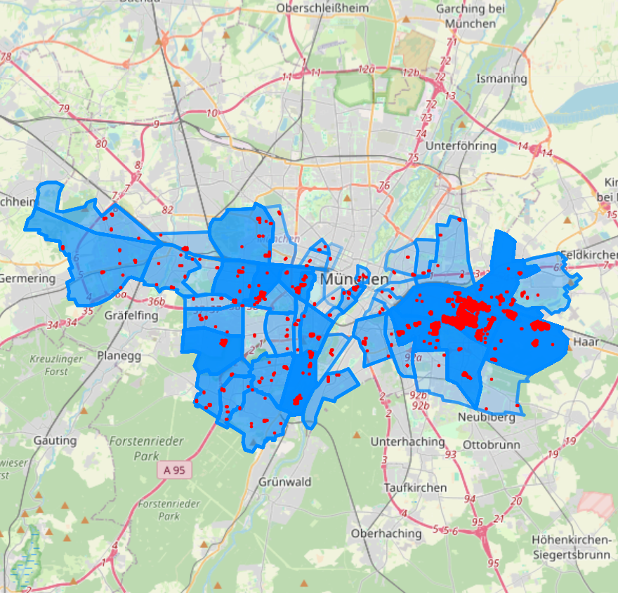
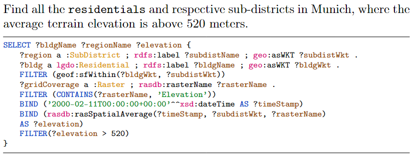

# Queries

| Queries                                                                                                                                                                                                                                                                                                                                                                                                                                    | Visuals                                       |
| ------------------------------------------------------------------------------------------------------------------------------------------------------------------------------------------------------------------------------------------------------------------------------------------------------------------------------------------------------------------------------------------------------------------------------------------ | --------------------------------------------- |
| <pre><code>SELECT ?regionName ?answer ?regionWkt {?region a :Region .?region rdfs:label ?regionName .?region geo:asWKT ?regionWkt .?gridCoverage a :Raster .?gridCoverage rasdb:rasterName ?rasterName .FILTER (?regionName = 'Bolzano') FILTER (CONTAINS(?rasterName, 'Tyrol'))BIND ('2023-03-03T00:00:00+00:00'^^xsd:dateTime AS ?timeStamp)BIND (rasdb:rasSpatialMinimum(?timeStamp, ?regionWkt, ?rasterName) AS ?answer)}</code></pre> |  |
|                                                                                                                                                                                                                                                                                                                                                                                                     |              |
